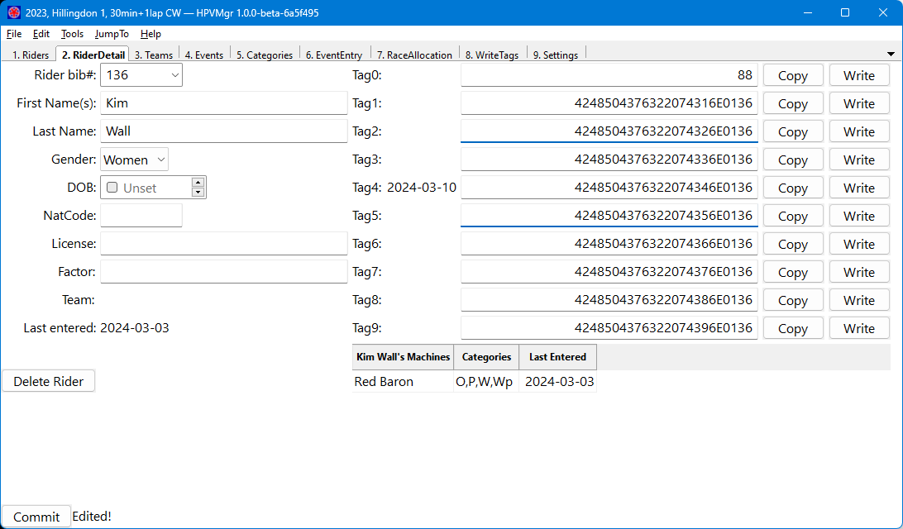

[TOC]

## Rider Detail

This alows you to view and edit the details of a rider.  Click the "**Commit**" button after making changes.

## Fields

Field|Description
:----|:----------
Bib|The rider's unique bib number.  Edit this field to select a different rider.  If you enter a bib that does not currently exist in the database, you will be asked if you would like to create a new rider.
FirstName|The rider's first name.  May contain any UTF-8 character.
LastName|The rider's lat name.  May contain any UTF-8 character.
Gender|The rider's gender.  CrossMgr supports 'Open', 'Men' and 'Women'.
DOB|The rider's date of birth, used to calculate their age.  Optional.
NatCode|The rider's nationality as a three-letter IOC code.  Optional.
License|The rider's license(sic).  This is passed directly to CrossMgr.  Optional.
Factor|The rider's factor (for para-cycling).  If the use of factors is enabled in [Settings][] this is passed directly to CrossMgr.  Optional.
Team|The last team the rider was entered in an event for.
Last entered|The date that the rider was last added to an [Event][Events] in HPVMgr, even if they were subsequently removed.  (Not the date of the event itself.)
Tag0-9|The 96-bit EPC code written to the rider's RFID timing tags, represented as a 24-digit hexadecimal number.  CrossMgr supports up to 10 tags per rider.  If a date is shown alongside a tag field, this is the last time the tag was written.
Rider's Machines|A list of machines (with associated [Categories][]) the rider has previously been entered on, used to pre-fill data on the [EventEntry] screen.  Right-click to delete a machine from the list (this will not affect existing event entries).

* Each tag number may be copied to the clipboard using the associated "**Copy**" button.  See [Settings][] for whether delimiters are included.
* Each tag number may be selected for writing using HPVMgr's built-in Impinj RFID reader support.  See [WriteTags][] for details.
* The "**Delete Rider**" button deletes the rider from the database.  If the rider has previously been added to the sign-on list for an [Event][Events] this will break the link to their details, including RFID tag numbers. Use with caution during a race season unless you've just created a new rider in error.
* The "**Commit**" button saves edits to the in-memory database (NatCode and Tag fields are validated in the process), but does not write them to disk.
