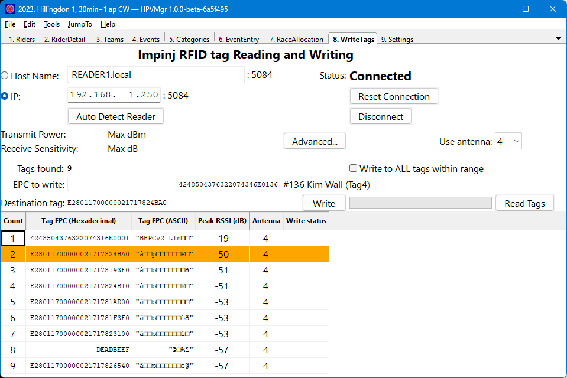

[TOC]

## WriteTags

HPVMgr can read and write the EPC field of RFID tags directly using a suitable LLRP tag reader, without any additional software.  This should greatly streamline the process of issuing tags to racers, as tag numbers can be taken directly from the rider database without having to enter them by hand.

### Configuring the RFID reader

These settings are similar to those of the **CrossMgrImpinj** and **TagReadWrite** applications.  Enter the host name or IPv4 address of the tag reader in the relevant fields.  The "**Auto Detect Reader**" button will attempt to determine the correct settings automatically, if this fails you will get an error message after a timeout.

Once the details are entered, click the "**Connect**" button to attempt to connect to the tag reader.  If this is successful, you should see the **Reader status** change to "**Connected**".

If you need to adjust the transmit power or receiver gain, these settings can be accessed via the "**Advanced**" button.  Click "**Reset Connection**" after making changes.  *At time of writing, a bug in the LLRP library causes an error if you attempt to change the transmit power.*

Select the antenna you want to use for reading and writing tags with the "**Use antenna**" dropdown.

### Reading tags

To perform a tag inventory, click the "**Read Tags**" button (Ctrl-R).  The table at the bottom of the screen will be populated with the details of any tags found, in order of RSSI (strongest signal first).  This can be refreshed at any time by clicking "**Read Tags**" again.

Field|Description
:----|:----------
Count|A row number, for ease of counting
Tag EPC (Hexadecimal)|The tag's *Electronic Product Code* as a 24-character hexadecimal number
Tag EPC (ASCII)|An attempt to render the EPC value as ASCII printable characters.  Not all digits may be printable.
Rider|If the EPC exists in the rider database, the bib number, rider name and tag number associated with it.  If there is more than one match, multiple lines are shown.
RSSI (dB)|The Received Signal Strength Indicator for that tag read, in decibels.  A higher (less negative) number means a stronger signal.
Antenna|The antenna used to read the tag.
Write status|If a tag write was just attempted, whether or not it was successful.

* Tag EPC numbers (either as hexadecimal or ASCII) and rider names can be copied to the clipboard by right-clicking on the tag table.

### Writing tags

#### Writing to a specific tag:

1. Ensure that "**Write to ALL tags within range**" is disabled.
1. Perform a tag inventory using the "**Read Tags**" button, and ensure the tag you want to overwrite appears in the list.
1. Click on the row of the desired tag.  It should be highlighted in orange, and the "**Destination tag**" field will be populated with its EPC.
1. The new EPC should go in the "**EPC to write**" field:  You can either select a rider's tag number from the database by clicking on one of the "**Write**" buttons on the [RiderDetail][] screen, or enter the EPC directly as a hexadecimal number of up to 24 characters.
1. Click the "**Write**" button (Ctrl-W).  The reader will attempt to change the EPC of the tag, and then perform another inventory.
1. If the write was successful, the tag will be highlighted in **green** and the "**Destination tag**" field will be cleared.
1. If the write was unsuccessful, or the tag cannot be found, the tag will be highlighted in **red**.  Try moving the tag with respect to the aerial and attempt the write again. 
1. If it still doesn't work, try writing the tag manually using the Impinj *MultiReader* application.  If that doesn't work, it's probably a faulty tag.

#### Writing to all tags within range:

It is possible to write tags without specifying the EPC of the tag you want to write to.  This simplifies the workflow, but **it is dangerous to do this unless you can guarantee that only the desired tag is in range**.  It is probably a bad idea to use this at the track-side, where someone may bring their tag into range in the time it takes you to press the button.

1. Enable the "**Write to ALL tags with range**" setting
1. Enter the new EPC in the "**EPC to write**" field as a hexadecimal number of up to 24 characters.  Alternatively, this may be automatically populated by clicking on one of the "**Write**" buttons on the [RiderDetail][] screen.
1. Click the "**Write**" button (Ctrl-W).  The reader will attempt to change the EPC of the tag(s), and then perform an inventory.

* Tags embedded in items for retail tracking are usually read-only and cannot be re-written - you may come across one of these in a cycle helmet or similar (the EPC may be markedly different from those of unwritten tags from the usual supplier).  In principle you could use this for timing by adding it to a rider's tag numbers; in practice the RF performance may be inadequate to detect the tag at a distance.
* Occasionally tags become faulty and refuse to change their EPC.  Bin them.
* If the connection to the tag reader fails when reading or writing tags, this is likely to be a network issue.
