[TOC]

# BHPC Workflow

This is intended to be a step-by-step guide to timing a BHPC event.  If you are not the [British Human Power Club](https://www.bhpc.org.uk), this may still be informative, but our somewhat arcane classification and scoring methods mean it diverges from typical CrossMgr workflow in important ways.

# Setting up the files

## File structure conventions

At the time of writing, race data on the timing laptop is kept in "`C:\Users\BHPC\Documents\BHPC Racing\`".  Each racing season (year) will have its own directory, with sub-directories named `CrossMgr`, `HPVMgr`, `Photos` and `SeriesMgr`.  Most of these will have sub-directories for each event (day of racing).

Directory|Used for...
:---|:------
`CrossMgr`|Files pertaining to organising and timing races.  This includes sign-on spreadsheets, race files, and generated results.  This is also a reasonable place to keep things like running order posters and any supplementary data such as GPX files, raw impinj logs and any media files that pertain to timing the race (eg. if you've videoed a finish, or scanned a handwritten results sheet).
`HPVMgr`|The HPVMgr database and backup files.
`Photos`|Published finish-line photos from CrossMgrVideo.
`SeriesMgr`|This for SeriesMgr data and generated points tables.

This structure is reproduced on the BHPC Google Drive.

The first thing you will need to do to set up a race, is create a directory for the event under "`C:\Users\BHPC\Documents\BHPC Racing\$year\CrossMgr\`", named something like "`07 Darley Moor"`

## Creating a Sign-on sheet

### Using the BHPC organisers' spreadsheet:

Traditionally, sign-on sheets for CrossMgr have been generated using the macros in the **BHPC organisers' spreadsheet**.  However, this is somewhat clunky and has the limitation of only supporting a single tag number per rider.  As the HPVMgr application is preferred, we will not document the process in detail here.

### Using HPVMgr:

**HPVMgr** is a dedicated application for managing the BHPC rider database, creating sign-on sheets and writing RFID timing tags.  It can support up to ten unique tag numbers per rider, and allows category and machine changes on a race-by-race basis.  More detailed documentation is available in its own help menu.

#### Setting up a new Event

Assuming that the **Season** and **Categories** have already been created (see the **HPVMgr** help for details)...

1. **Open HPVMgr** and ensure the correct rider database is loaded.
1. Switch to the **Events** screen, and select the relevant **Season**.
1. Right-click on the Events list and select "**Add new event**" from the context menu.  Enter a name for the event (eg. "`Hillingdon1`").
1. Right-click on the event and select "**Change [event]'s date**" to set the date of the event.
1. With the new **Event** selected, right-click on the **Rounds** list and select "**Add new round**" from the context menu.  Enter a name for the new round (eg. "`30min+1lap ACW`").
1. Repeat the above step until you have entered all the Rounds for the Event.
1. Enter a file name for the Sign-on sheet.  For example, "`C:\Users\BHPC\Documents\BHPC Racing\$year\CrossMgr\07 Darley Moor\racers_darley_moor.xlsx`"

#### Entering riders in the Event

1. If you have new Riders who are not listed on the **Riders** screen, add them to the database and fill in their details using the **RiderDetail** page.
1. Select the **Event** on the **Events** screen.
1. Switch to the **EventEntry** screen.  The event name will appear at the top of the screen.
1. Select a **Rider** using the "**Bib**" drop-down, or by entering their name in the "**Name**" field.
1. Select a previously-used **Machine**, or enter the name of a new one, in the "**Machine**" combobox.
1. Enter the name of the **Team** the rider is racing for in the "**Team**" combobox; leave blank if none.
1. Select the rider's **Categories** for this event.
1. Click the "**Enter rider**" button to add them to the racers list.

#### Allocating riders to races

1. Switch to the **RaceAllocation** screen.  Ensure the correct round name is selected at the top of the screen.
1. The **Number of races in this round** field will read `0`.  Change it to the appropriate number of races.  Don't worry about the warning at this point, as there is no allocation data to lose.
1. Using the right-click context menu options, move racers between races until you are happy with the allocation.  Usually slower and inexperienced racers are allocated to the first group (but exceptions may be made for logistical reasons, eg. because someone will be arriving late, or so that the time team are not all in the same race).
1. Select the next round.
1. You can use the "**Copy allocation**" button to copy the allocation you made for the previous round.  Otherwise, make whatever changes are needed to the number of races and allocations as described above.
1. When you are happy with all the allocations, click "**Write sign-on sheet**" to write the `.xlsx` file to disk for CrossMgr.

* The "**TT start times**" option is only needed if you intend to run a time trial where riders start at published times.  It is not needed for the usual BHPC style informal time trial.
* You can come back and make changes to the allocation, or alter a rider's machine or categories, and re-write the sign-on sheet at any point.  CrossMgr will pick up the changes next time it loads the file and update the race resuts accordingly.

### Creating the sign-on sheet manaually

Otherwise you can manually generate an Excel `.xlsx` file containing a sheet for each Race, with columns for the rider's name, RFID tag number(s) and race categories.  See [DataMgmt][] for more details of the format.

## Creating a CrossMgr race file

**The easiest way to create a CrossMgr race file is to open a known-good previous race and select [New Next][File] from the file menu.  This will preserve most of the settings of the previous race, so you only have to alter those that differ.**

To create a new CrossMgr race from scratch:

1. Open CrossMgr, and select [New][File] from the file menu.  The **Configure Race** dialog will appear.
1. Enter an event name.  Avoid the use of spaces here, as this will be used for the filename (spaces in filenames can unnecessarily complicate matters when files are uploaded to the web).
1. Use the **Browse...** button to set **Race File Folder** to the directory you created, eg. "`C:\Users\BHPC\Documents\BHPC Racing\2025\CrossMgr\07 Darley Moor`"
1. At this point you can click 'OK' (to the left of the **Configure Race** dialog), and your race file will be created.  By doing this and making changes later it is harder to accidentally lose your work than by configuring everything within the dialog.
1. You will now be looking at the Actions page for your unstarted race.  Switch to the [Properties][] screen, where you can begin configuring the various settings.

## Common configuration options

These options are common to all BHPC events and are unlikely to change between races.

### RFID

1. Within [Properties][], switch to the [RFID][] tab.
1. Enable **Use RFID Reader During Race**.
1. Select **Manual Start:  Collect every RFID read**.
1. Leave "**Ignore RFID reads for unstarted time trial riders**" unset.
1. Click **Setup/Test RFID Reader** and ensure the **Reader Type** is set to **JChip/Impinj/Alien**.
1. Click 'OK' to close the **Chip Reader Setup**
1. Click 'Commit' to save the changes.

### Web

1. Switch to the **Web** Tab
1. Set **Contact Email** to `compsec@bhpc.org.uk`
1. Set the graphic to the 200 pixel wide BHPC logo from `C:\Users\BHPC\Documents\BHPC Racing\bhpc_logo_200px.png` (Weirdly, you have to select the folder before you can select the image file.)
1. Click 'Commit' to save the changes.

### (S)FTP

1. Switch to the [(S)FTP][FTP] tab.
1. Select the **FTPS (FTP with TLS)** protocol.
1. Set the **Host Name** to `ftp.websitelive.net`
1. The port should be set to `21`
1. The upload path should be `www2.bhpc.org.uk/public_html/wp-content/uploads/Events/liveresults`
1. Set the username and password.  (Not reproduced here for security reasons.)
1. Enable **Automatically Upload Results During Race**
1. **URL Path** should be `http://www.bhpc.org.uk/wp-content/uploads/Events/liveresults`
1. Click 'Commit' to save changes.

You can use the **Test Connection** button to confirm that the FTP details are correct.

### Batch Publish

1. Switch to the [Batch Publish][] tab.
1. Enable "**HTML**" and "**Index HTML**", and enable the FTP option for both.
1. Ensure all other formats are disabled.
1. Ensure BikeReg is set to **None**
1. The **Post Publish Command** field should be empty.
1. Click 'Commit' to save changes.

### Camera

1. Switch to the [Camera][] tab.
1. Select "**Photos on Every Lap**"
1. Click 'Commit' to save changes.

## Race-specific options

These options are specific to the race.

### General Info

1. Switch to the [General Info][] tab.
1. The **Event Name** should be correct from earlier.
1. Enter a full description in **Long Name**.  Spaces are fine.  For example "Darley Moor R1 40min +1lap CW faster group"
1. Fill in the location and **Date** fields.
1. For **Discipline**, enter "HPV"
1. **Race #** should be set to the number of the race in that event (day of racing).  For example, if you're splitting the field into fast and slow groups, the first race of the second round would be race #3.
1. **Scheduled start** is the published start time, don't worry if the race starts a bit late (this will be noted in the results automatically).
1. Race minutes should be set to the nominal length of the race.  (NB. for a criterium, this should be set considerably longer.)
1. Set **Organiser** to your name.
1. Leave the **Memo** field blank, as it is appended to the filename.
1. Click 'Commit' to save changes.

### Race Options

The settings here will depend on the format of the event:

#### A) Criterium race

A criterium is a mass start race of a given duration, plus an extra whole lap.  CrossMgr cannot automate this fully, as it cannot determine exactly when the leader is going to get the bell.

1. Switch to the [Race Options][] tab.
1. Disable **Time Trial** and enable **Criterium**.
1. Enable **All Categories Finish After Fastest Rider's Last Lap**.
1. Enable **Set 'Autocorrect Lap Data' option by Default**.
1. Disable **Show times to 100s of a Second**.
1. Disable **Road Race Finish Times**.
1. Disable **Estimate Laps Down Finish Time**.
1. Set **Rank finishers by** to "**average speed**".
1. Enable **Consider Riders in Spreadheet to be DNS if no race data**.
1. Set **Lap time for 80% rule** to **2nd lap time**.
1. Set **Distance Unit** to **miles**.
1. Enable **Show Lap notes, Edits and Projected Times in HTML Output**.
1. Enable **Show Course Animation in Html**.
1. Set the **Min possible Lap Time** to a healthy margin less than whatever Slash was lapping at last time we raced on this track.  If in doubt, lower is better.
1. Set **Play reminder sound** to `10` seconds.
1. Leave **License Link...** empty.
1. Disable **Win and Out**.
1. Click 'Commit' to save changes.

#### B) Fixed-duration race

A mass-start race where riders finish after the leader crosses the finish line after a given duration.  Unlike a criterium, CrossMgr can work out when the end of the race is without intervention.

1. Switch to the [Race Options][] tab.
1. Disable **Criterium** and **Time Trial**.
1. Enable **All Categories Finish After Fastest Rider's Last Lap**.
1. Enable **Set 'Autocorrect Lap Data' option by Default**.
1. Disable **Show times to 100s of a Second**.
1. Disable **Road Race Finish Times**.
1. Disable **Estimate Laps Down Finish Time**.
1. Set **Rank finishers by** to "**average speed**".
1. Enable **Consider Riders in Spreadheet to be DNS if no race data**.
1. Set **Lap time for 80% rule** to **2nd lap time**.
1. Set **Distance Unit** to **miles**.
1. Enable **Show Lap notes, Edits and Projected Times in HTML Output**.
1. Enable **Show Course Animation in Html**.
1. Set the **Min possible Lap Time** to a healthy margin less than whatever Slash was lapping at last time we raced on this track.  If in doubt, lower is better.
1. Set **Play reminder sound** to `10` seconds.
1. Leave **License Link...** empty.
1. Disable **Win and Out**.
1. Click 'Commit' to save changes.

#### C) Fixed number of laps

A mass-start race where all racers ride the same number of laps.  Riders will have to count their own laps, and should be encouraged to continue racing if they lose count (which they probably will).

1. Switch to the [Race Options][] tab.
1. Disable **Criterium**.
1. Disable **Time Trial**.
1. Disable **All Categories Finish After Fastest Rider's Last Lap**.
1. Enable **Set 'Autocorrect Lap Data' option by Default**.
1. Disable **Show times to 100s of a Second**.
1. Disable **Road Race Finish Times**.
1. Disable **Estimate Laps Down Finish Time**.
1. Set **Rank finishers by** to "**average speed**".
1. Enable **Consider Riders in Spreadheet to be DNS if no race data**
1. Set **Lap time for 80% rule** to **2nd lap time**.
1. Set **Distance Unit** to **miles**.
1. Enable **Show Lap notes, Edits and Projected Times in HTML Output**.
1. Enable **Show Course Animation in Html**.
1. Set the **Min possible Lap Time** to a healthy margin less than whatever Slash was lapping at last time we raced on this track.  If in doubt, lower is better.
1. Set **Play reminder sound** to `10` seconds.
1. Leave **License Link...** empty.
1. Disable **Win and Out**.
1. Click 'Commit' to save changes.

* Ensure that the **Lapped riders continue** setting on the [Categories][] screen is set correctly.  (See below)

#### D) *n*-lap Time Trial

A time trial is where riders start individually one after another, and compete against the clock.

1. Switch to the [Race Options][] tab.
1. Disable **Criterium** and enable **Time Trial**.
1. Disable **Best n laps**.
1. Enable **All Categories Finish After Fastest Rider's Last Lap**.
1. Enable **Set 'Autocorrect Lap Data' option by Default**.
1. Enable **Show times to 100s of a Second**.
1. Disable **Road Race Finish Times**.
1. Disable **Estimate Laps Down Finish Time**.
1. Set **Rank finishers by** to "**average speed**".
1. Enable **Consider Riders in Spreadheet to be DNS if no race data**.
1. Set **Lap time for 80% rule** to **2nd lap time**.
1. Set **Distance Unit** to **miles**.
1. Enable **Show Lap notes, Edits and Projected Times in HTML Output**.
1. Enable **Show Course Animation in Html**.
1. Set the **Min possible Lap Time** to a healthy margin less than whatever Slash was lapping at last time we raced on this track.  If in doubt, lower is better.
1. Set **Play reminder sound** to `10` seconds.
1. Leave **License Link...** empty.
1. Disable **Win and Out**.
1. Click 'Commit' to save changes.

#### E) Best of *n* laps

A variation on a time trial, where riders complete several laps, but are only scored on one of them.  Good for velodromes.

1. Switch to the [Race Options][] tab.
1. Disable **Criterium** and enable **Time Trial**.
1. Enable **Best n laps**.
1. Enable **All Categories Finish After Fastest Rider's Last Lap**.
1. Enable **Set 'Autocorrect Lap Data' option by Default**.
1. Enable **Show times to 100s of a Second**.
1. Disable **Road Race Finish Times**.
1. Disable **Estimate Laps Down Finish Time**.
1. Set **Rank finishers by** to "**average speed**".
1. Enable **Consider Riders in Spreadheet to be DNS if no race data**.
1. Set **Lap time for 80% rule** to **2nd lap time**.
1. Set **Distance Unit** to **miles**.
1. Enable **Show Lap notes, Edits and Projected Times in HTML Output**.
1. Enable **Show Course Animation in Html**.
1. Set the **Min possible Lap Time** to a healthy margin less than whatever Slash was lapping at last time we raced on this track.  If in doubt, lower is better.
1. Set **Play reminder sound** to `10` seconds.
1. Leave **License Link...** empty.
1. Disable **Win and Out**.
1. Click 'Commit' to save changes.

#### F) Flying Sprints

These are timed using the dedicated SprintTimer application, rather than CrossMgr.  See SprintTimer's Quick-Start guide for how to set up and time a flying sprint event.

### Set the course GPX

1. Switch to the [GPX][] tab.
1. Click **Import GPX Course**
1. Browse to the `.gpx` file of the track.  A selection of previously-used courses are available in `C:\Users\BHPC\Documents\BHPC Racing\track_gpx\`.  (If you are creating a new GPX, the best way to do it is to ride the track at racing speed with a GPS receiver set to record one trackpoint per second.  The speed and elevation data will be used to improve the animation.)
1. Select **Course is a loop**.
1. Once loaded, check the direction arrow on the map.  If necessary, use the **Reverse Course Direction** icon to point it the other way.
1. Click 'Commit' to save changes.

### Linking the sign-on sheet

1. Switch to the **Files/Excel**" tab.
1. Click "**Link External Excel Sheet**".
1. Browse to the location of your sign-on spreadsheet, and click **Next**.
1. Now select the name of the sheet containing the sign-on data for this race, and click **Next**.
1. As you have named your columns with the headings that CrossMgr expects, the only thing you need to do on this page is select the **Initialize CrossMgr Categories from Excel EventCategory/CustomCategory and Bib# columns** option.  Click **Next**.
1. With any luck the summary page will announce status "*Success!*" with errors "*None*".  If not, check your spreadsheet format.  Click **Finish**.  You have now linked the sign-on data.
1. The **Find Rider** window will open automatically to show you the imported rider data.  Click **'Close'**

### Categories

1. Move to the [Categories][] screen.  You should see categories corresponding to those in the sign-on sheet.  If the category names or rider numbers are incorrect, make the relevant changes in the spreadsheet.
1. Click the **Set Gpx Distance** button to ensure that the **Distance** is set for all categories.
1. **Dist. By** should be set to **Lap** for all categories.
1. **First Lap Dist.** should be empty for all categories.
1. Rearrange the order of the categories by clicking and dragging the grey square at the start of each row.  The **Start Wave** should be at the top, followed by *Custom* categories, in the order: Open, Partly-faired, Unfaired, Faired Multitrack, Multitrack, Street, Women, Women Part-faired, Arm-powered, Junior, Car-free.
1. Check that the category **genders** are correct - CrossMgr sometimes makes incorrect assumptions where open categories only have riders of one gender.
1. **Start Offset** should be zero for all categories.
1. If this is a *time trial*, *fixed laps* or *best of n laps* race, ensure the correct values are entered in the **Race Laps** and **Best Laps** columns for each category.  (For example, for a "best of three" round, set **Race Laps** to `3` and **Best Laps** to `1`.)  Otherwise, ensure these columns are empty.
1. **Lapped riders continue** should be unset for criterium and fixed-duration races.  For a fixed number of laps, it should be set.
1. Ensure the **Race Minutes** column is empty for all categories; the global setting in [General Info][] will be used instead.
1. **Publish** should be enabled for all categories.  **Series** should be enabled for all except the Start Wave.  (**Upload** is for results formats we do not use, so it does not matter whether it is enabled.)
1. When you are satisfied, Click **Commit** to save changes.

---

At this point your race file should be ready for use.

* Either close CrossMgr, or use [New Next][File] to create the next race file based on the settings in this one.  (I like to create an additional dummy time trial with everyone in it to use for testing RFID tags before the racing starts.)

#### After creating multiple race files, double-check the following:

* File naming is consistent.
* The correct Sheet is selected in the sign-on Excel file.
* Start times are correct.
* Race Minutes is correct.
* Race direction is correct, both in the GPX and the race name.

If you change a race's filename, the original file will be left in place.  You may want to delete the old file now so as not to use the wrong one by mistake on race day.

# Writing RFID timing tags

## Tag number schema

Impinj RFID tags have a programmable EPC field that allows up to 96 bits of arbitrary data to be stored.  When tags are read by CrossMgrImpinj during a race, this data is passed to CrossMgr as a hexadecimal string of up to 24 characters, along with the time the tag is read.  This allows tags - and by implication the rider or machine they're attached to - to be identified.

### Old system (pre 2024 season)

Pre-2024, the BHPC would **directly encode the rider's bib number on the tag, as a hexadecimal value**.  For example rider #10 would have `a` encoded on their tag, and rider #136 would have `88` encoded on their tag.  Riders would be issued with multiple tags containing the same number.

This made life easier for Excel, but was a pain for the timing team, as we would have to convert decimal to hexadecimal when writing tags manually.

### New (v2) system

In an attempt to address some of the inadequacies in the above system, from 2024 onwards, we are using the following schema:

- **The first 16 characters** of the EPC will **always contain `4248504376322074`**.  This identifies a tag as belonging to the BHPC, and reads "**`BHPCv2 t`**" when rendered as ASCII.
- The **17th character** contains **`3`**.  This combines with the 18th character to make an ASCII digit.
- The **18th character** contains the **unique tag number**, from `0-9`.
- The **19th and 20th** characters contain **`6E`** ('`n`' in ASCII)
- **Characters 21-24** contain the rider's **bib** number **as a decimal string** eg. rider #136 would be encoded as `0136`.  (This does not convert to ASCII in a meaningful way.)

So, for example `4248504376322074316E0001` would be rider #1's tag number 1.  When displayed as ASCII, it would read `"BHPCv2 t1n"` (last two characters unprintable).  `4248504376322074346E0102` would be rider #102's tag no 4.  When displayed as ASCII, it would read `"BHPCv2 t4n"` (last two characters unprintable).

The advantages of this approach are:

- Reduced risk of overlapping with another event's tag schema, so our tags are less likely to cause problems at other events.
- Individual tags having their own numbers mean that the QuadReg algorithm can process them separately, which should improve the timing accuracy.
- We can eliminate a specific tag from the sign-on sheet while still using the rider's other tags - useful if they leave a spare helmet or fairing near the finish line during the race.
- As the last 4 characters of the EPC string are decimal-encoded, it becomes immediately obvious which rider a tag belongs to when viewed in the sign-on sheet, [Unmatched RFID Tags][Windows] window or CrossMgrImpinj log.
- Supports up to 10,000 riders, with up to 16 tags each (although CrossMgr and HPVMgr can only support 10 tags per rider).

### Use of tag numbers

In the interests of **backward compatibility**, we continue to support the **old bib-as-hexadecimal schema using the first tag field** in the sign-on sheet ('**Tag0**' in HPVMgr).  We will use the **new schema for tags 1-9**, and try to use a least-recently-used tag number when issuing new tags.  As HPVMgr records when tag numbers were last written, it should be possible to avoid too many tags with identical numbers in circulation.

## Writing tags using HPVMgr

**HPVMgr** is the new dedicated BHPC sign-on application.  As well as managing the rider database and sign-on sheets, it can control the Impinj reader directly in order to write RFID tags.  This has the advantage of a less fiddly user interface, and not having to deal with hexadecimal numbers manually.  It also keeps a record of when tags were last written for each rider, useful when working with unique tag numbers.  For more information about HPVMgr, see its own help documentation.

1. Dig out the blank tags, and cut a pair of them off the roll.  Mark the **front** of the tags with **the rider's bib number** in permanent marker pen.
1. Ensure that the **CrossMgrImpinj** application is not running.
1. Open the **HPVMgr** application.  It should load the rider database automatically.
1. Switch to the **WriteTags** screen and ensure that it is configured to connect to the reader using the IPv4 address `192.168.1.250`  (The settings from the last successful connection to the reader should be restored.)
1. Click the "**Connect**" button to connect to the reader.  If this is not successful, you probably have an incorrect address or a network problem.
1. Select the **antenna** that you want to write tags with.  The Desktop antenna is usually **Antenna 3**, while the patch antenna built into the RFID reader flightcase is **Antenna 4**.
1. Ensure that "**Write to ALL tags within range**" is disabled, unless you know what you are doing!
1. With the connection to the reader established, switch to the **RiderDetail** screen and select the rider whose tags you need to write.  (If you do not know their **Bib** number, you may find it easier to select the rider from the list on the **Riders** screen first.)
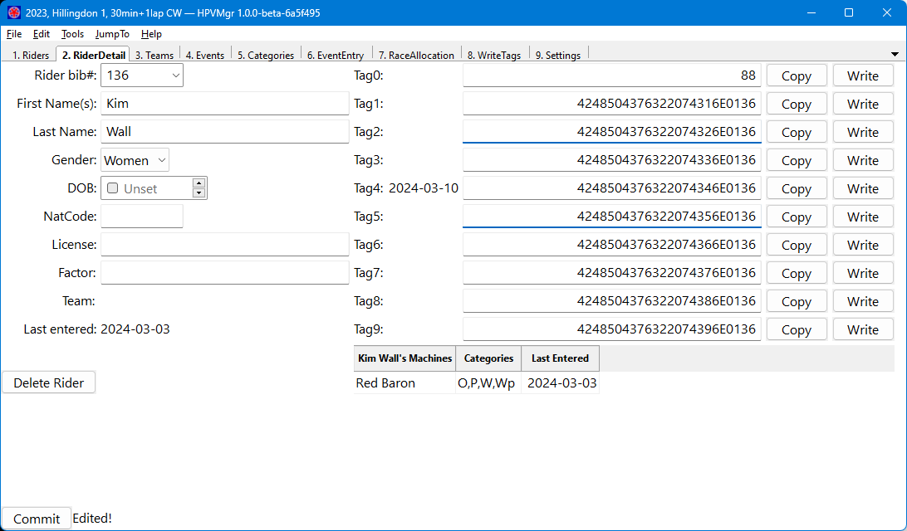
1. Examine the rider's list of tag numbers, and decide which you are going to write.  The last-written dates may be hepful to avoid clashes with an existing tag on a spare helmet or similar.  (Unique numbers for each tag improve QuadReg performance and mean that stray tags can be excluded from a race retrospectively.)
1. Click the "**Write**" button.  You will be taken back to the **WriteTags** screen, and the "**EPC to write**" field will be populated with the rider's tag number.
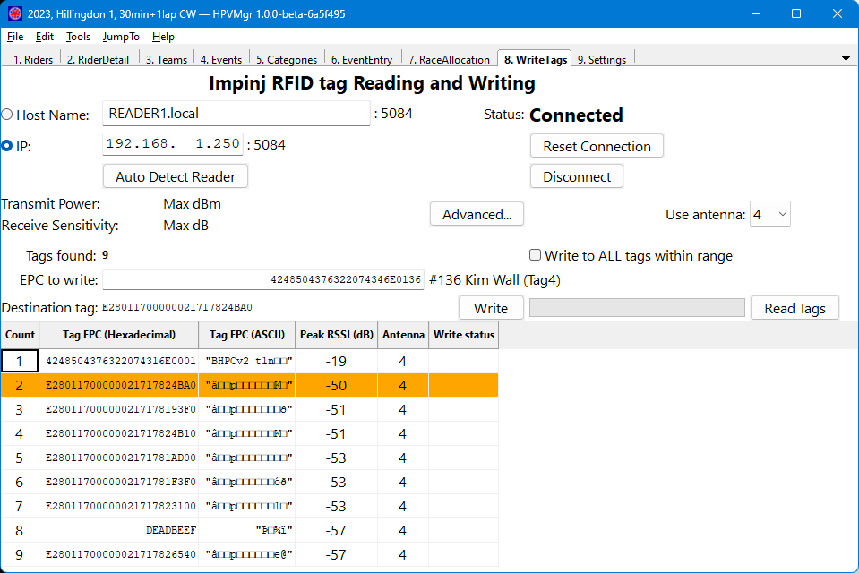
1. Ensure the tag you wish to write to is in place near the selected antenna, click "**Read Tags**" to refresh the inventory list.
1. Select the relevant tag by clicking on it in the list.  It will be added to the "**Destination tag**" field.
1. Click "**Write**" to write the new EPC to the tag.  If the write is successful, it will be highlighted green in the list.  If not, try moving the tag with respect to the antenna and trying again.
1. Give the tags to the rider.
1. Save changes before exiting the HPVMgr application, so the tag write dates are stored in the database.
1. If necessary, **restart CrossMgrImpinj** and ensure it connects to the tag reader.

## Writing tags using MultiReader

The older method uses the **Impinj MultiReader** application to write the tags, which means you need to be able to enter the hexadecimal EPC number for the tag manually.  HPVMgr might be used to copy the correct EPC to the Windows clipboard in order that it may be pasted into MultiReader.

1. Dig out the blank tags, and cut a pair of them off the roll.  Mark the **front** of the tags with **the rider's bib number** in permanent marker pen.
1. Ensure that the **CrossMgrImpinj** application is not running.
1. Establish what the rider's **tag numbers** should be in hexadecimal (refer to the sign-on sheet if necessary), and write this on the **back** of the tags' backing sheet.  *Do not trust yourself to hold this in short-term memory; someone will distract you and this is how mistakes get made*.
1. **Close CrossMgrImpinj**, if it is running, to free up the tag reader.
1. If the desktop aerial is not connected to port 3, follow the instructions above to connect it.
1. Start the Impinj **MultiReader** application, and *connect to the configured reader*.
1. Place the tags on top of the desktop aerial (weighing them down with something non-conductive so they don't blow away).
1. Click the **START Inventory Run** button.  Two tag numbers shold appear in the list to the left.  Stop the inventory run.
1. Right-click on one of the tag numbers, and select **Change EPC**.
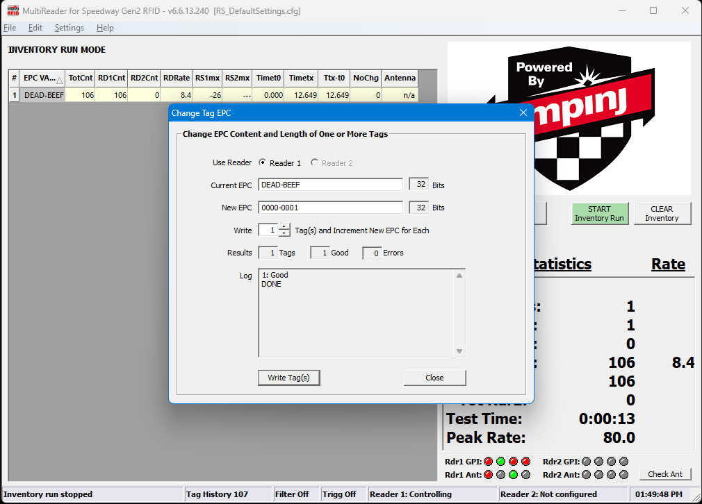
1. Referring to the tag's backing sheet, enter the new tag number as a hexadecimal number, including leading zeroes (delimiting each group of 4 hexadecimal digits with a '-'), and click **Write tag**.  Check the **Log** pane to confirm this has worked.
1. Close the window, and change the EPC of the *other* tag in the same way.  (Note that if you attempt to write a tag twice, the subsequent attempts will fail, as the current EPC of the tag will have changed on the first successful attempt.)
1. Do the **inventory run** again; you should only see the correct tag number.
1. Give the tags to the rider, **close MultiReader**.
1. If necessary, **restart CrossMgrImpinj** and ensure it connects to the tag reader.

#  Race Day

## Hardware setup

**Prerequisites:  Timing tent (or other suitable shelter) erected with AC power available.**

The setup process has been simplified by integrating the router and RFID reader into the flight-case, along with a redundant power supply and GPS time source.  This means that many of the connections are permanently in place, and you only need to connect the power source(s), Ethernet to the laptop and RFID aerials on race day.

If you are using a generator, start it and allow the output to stabilise before connecting the timing equipment.  This prevents damage from voltage spikes or repeated cycling on and off.

1. Unpack the cables and loose equipment from the flight-case.  **Prop the flight-case lid open** by engaging the piece of aluminium profile on the right hand side of the lid with the protruding bolt in the base.
1. Locate the black **AC power cable** for the flight-case.  This has a standard **13A BS1363 mains plug** on one end, and a circular female **PowerCon** connector on the other.  Insert this in the male PowerCon **AC power inlet** on the side of the flight-case, and twist clockwise so it clicks into place.
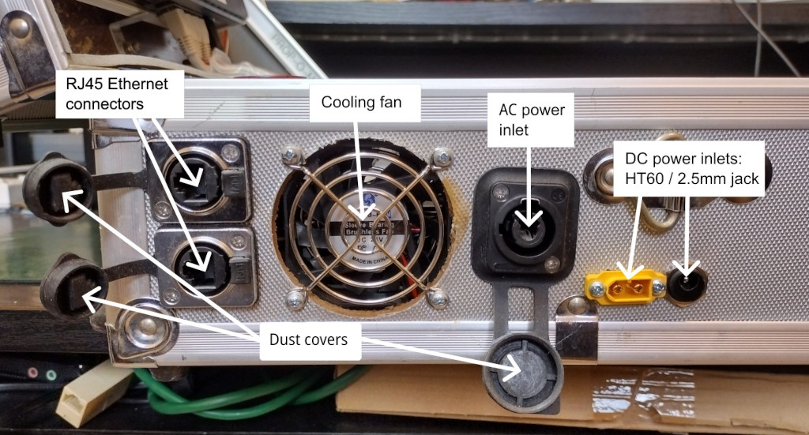
Connect the other end to mains power (or another 85-265V AC supply, eg. from a generator or inverter).  An adaptor should be present in the crate of timing equipment to adapt BS1363 to 16A IEC 60309 (the blue Ceeform commonly used for caravan hookups).
1. The AC power display on the power supply should light up and indicate the voltage and frequency of the AC supply, with a power draw in the region of about 15W as the router and tag reader boot up.  The DC power display will flash its backlight in alarm and show a voltage of 0V (occasionally this mis-reads as 99.99V), indicating that a DC supply is not present.
1. **DC power** of 12-36V can be connected using one (or more) of: **(A)** The small black centre-positive **2.5mm DC barrel jack** inlet on the side of the flight-case.  (A short jack-jack cable is included to connect to a 2.1mm DC jack)  **(B)** The yellow **male XT60** connector on the side of the flight-case. (Cables are included to connect to spade terminals, or a 12V vehicle cigarette lighter socket) **(C)** The **female USB-C inlet** on the bottom left of the power supply panel. (Cables not included.  The USB power source must be 'laptop' rated - a standard phone-charging power bank cannot provide enough power to run the tag-reader)  Once connected, the DC power display should show a voltage appropriate for your power source, but no significant current/power will be drawn while AC power is present.  If DC power does not appear to work, check the polarity, and the respective inlet fuse.
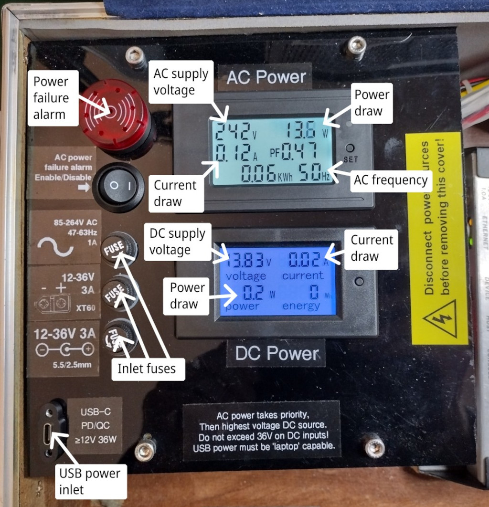
1. Ensure the **AC power failure alarm** switch is in the '**on**' position.  As long as DC power is present, the alarm will sound if the AC supply is interrupted.
1. Connect the **laptop's power supply** to AC power and the DC power inlet on the left side of the laptop.
1. Optional: Connect the **mouse** to the USB port on the right side of the laptop.  (The trackpad can be unreliable when operated with sweaty fingers.)
1. Locate the **red Ethernet cable**.  This has a standard RJ45 plug on one end, and a rugged RJ45-in-an-XLR-shell plug on the other.  Connect the XLR end to *either* of the two XLR-RJ45 sockets on the side of the flight-case, and the standard RJ45 to the fiddly Ethernet socket on the left side of the laptop next to the power inlet.
1. Locate a pair of **long coaxial cables** of appropriate lengths for the track (they're stored separately in in the crate of timing stuff) and connect the male N-connectors to the RFID aerials (which should have right-angle N adaptors attached), and the RP-TNC plugs to the RP-TNC jacks on the tag reader (passing the cables through the holes in the side of the flight-case).  The far-side aerial should be the one covered in ScotchLite retro-reflective tape.
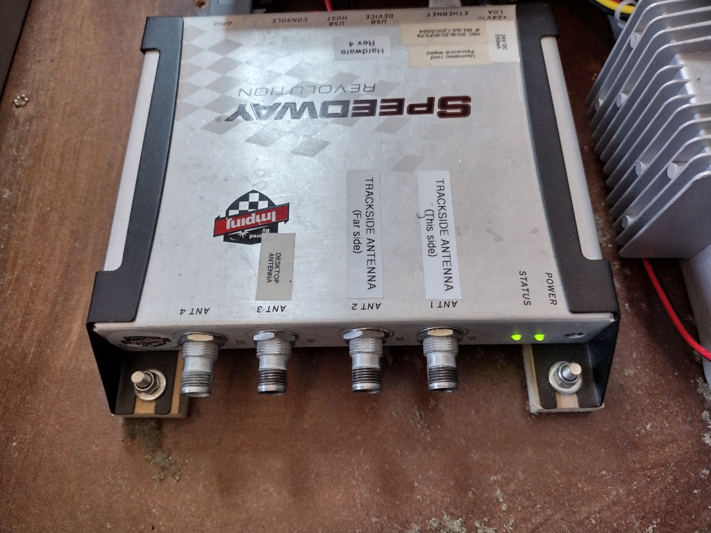
By convention, we connect the near-side aerial to channel 1 on the tag reader, and the far-side aerial to channel 2.  (This makes it easier to determine which isn't working properly if there's a fault.)
1. Optional (only needed **for writing tags**): Locate the short coaxial cable with a TNC plug on one end and RP-TNC plug on the other, and use this to connect the 'desktop' aerial to channel 3 of the tag reader.
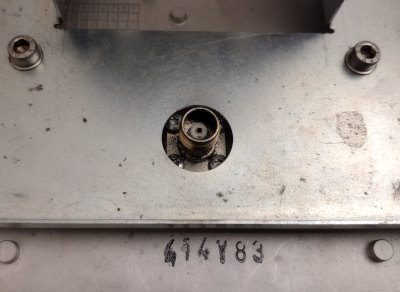
**Ensure that you've got the cable the right way round by paying particular attention to the central pins of these confusingly stupid connectors.**
1. Attach the camera to a tripod, and connect it to one of the **USB ports** on the left side of the laptop.
1. Locate the pale grey **USB-A to USB-B cable** and connect the **Trigger-O-Matic** to one of the **USB ports** on the left side of the laptop.  Ensure the auto-capture toggle switch is set to 'disable'.  The Trigger-O-Matic is not needed if you will be using the Sprint Timer.
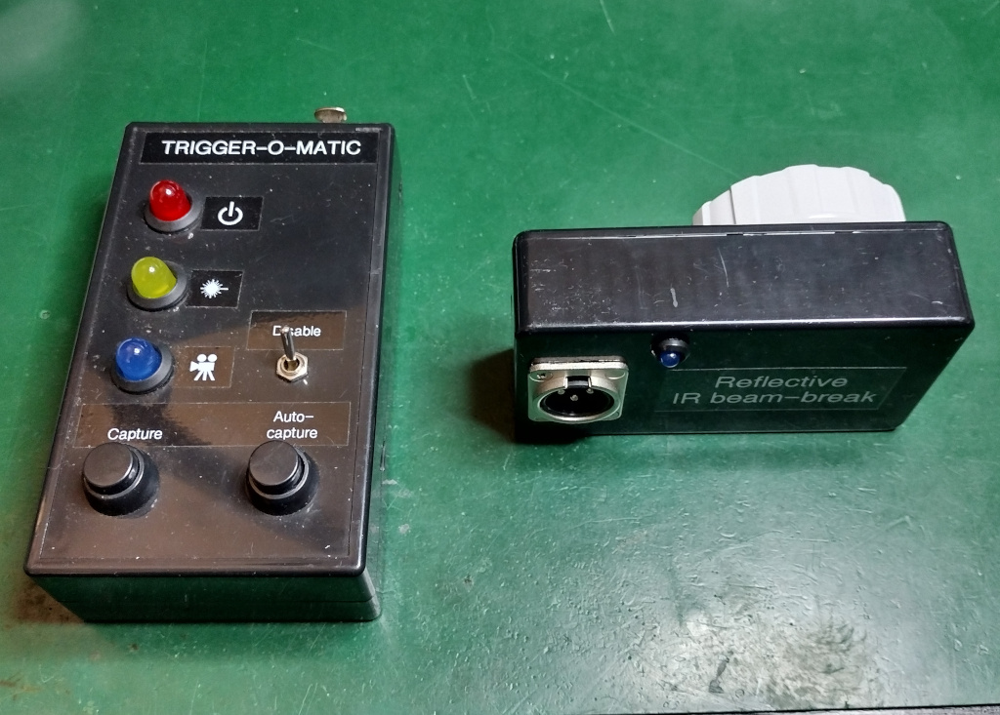
1. Optional: Screw the **reflective IR beam break** unit onto its drainpipe and mount it on its stand beside the nearside RFID aerial.  Locate the black **male 3-pin XLR to female 3-pin XLR** cable and use it to connect the IR beam-break unit (alternatively, a tape-switch) to the XLR socket on the Trigger-O-Matic.
1. Optional: Erect the **Race Clock**'s stand (ensuring that the clamps are tightened and securing pins are in place, and fit the clock to it.  Rotate the clock gently until you feel the hole in the base of the top-hat drop into place around the excentric allen bolt on the end of the stand (this prevents it rotating in the wind).  Pick up and rotate the entire stand to point the clock in the right direction - **do not force it to rotate on the stand, or the securing pins will be damaged**.  Do not use the stand in strong winds - the clock may fall over and be damaged.
1. Locate the **Race Clock power cable** (stored separately in the crate of timing stuff), and connect the female PowerCon connector to the back of the clock (again, twisting clockwise to click into place).  Connect the mains plug to AC power.  The clock should boot up and display "`bhpc`" and then alternate between the time of day and temperature as it searches for a WiFi network.

### Far side of track close to finish line (Stourport) variation

* Due to problems caused by reading tags of riders on the far side of the track, we have found that it works better to use the **desktop aerial**, lying on the ground **facing upwards** at the trackside in place of the usual **nearside** aerial.
* This limits the pickup range to approximately 3 metres horizontally (about half the width of the track), and prevents spurious reads from riders on the far side.
* Connect it to port 1 of the tag reader, and the software will not need to be re-configured.

### Sprint Timer

Additional steps are needed if you will be using the Sprint Timer Unit.  See the **SprintTimer** help for more information.

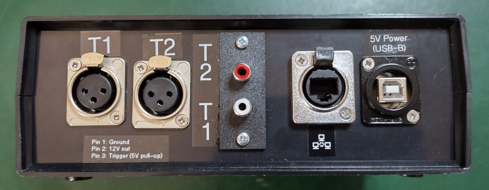

1. Use the pale grey **USB-A to USB-B cable** to connect the **Sprint Timer Unit** to one of the **USB ports** on the left side of the laptop.  (The Trigger-O-Matic is not needed for timing sprints.)  This provides 5V power to the Sprint Timer Unit.
1. Locate the **blue Ethernet cable** (usually kept with the Sprint Timer Unit).  This has a rugged RJ45-in-an-XLR-shell plug on *both* ends.  Use it to connect the **Sprint Timer Unit** to the unused Ethernet socket on the side of the flight-case.
1. The sprint timer should boot up and obtain an IP address from the router using DHCP.  It will begin searching for a GPS signal.
1. Connect the **Timing gates** to the **T1** and **T2 inputs** on the sprint timer using **XLR cables**, as described in the **SprintTimer** documentation.
1. Further steps are required to verify the operation of the sprint timing system.  See the Quick Start guide in the **SprintTimer** documentation.

### Resetting the energy meters

The AC and DC power meters keep track of the energy used.  This may be useful when running on battery power.  While both meters are operated using a single tactile button to the right of the display, the procedure for resetting the totals is confusingly different for the two meters.

#### AC power meter (top)
1. Hold down the button.  `255 Hi` will be displayed.  Release the button.
1. Click the button to cycle through `100 Lo` and `1.0 OL` until `CLr` is displayed.
1. Hold down the button until `CLr` starts flashing.  Release the button.
1. The energy total should now read `0.00 kWh`

#### DC power meter (bottom)
1. Hold down the button until `SET` (the 'T' doesn't look very much like a 'T') is displayed.  **Keep holding** until `CLr` is displayed.  Release the button.
1. The energy total should now flash.  Click the button to zero it.
1. The energy total should now read `0 Wh`

* We recommend that this is done before travelling to the race venue.  You will forget to do it on the day.
* Note that the two meters use different units!

## Software startup and testing

### CrossMgrVideo

1. **Boot up the laptop**, and ensure that it is receiving external power.
1. Start **CrossMgrVideo**.  Hopefully you should see the view from the finish-line camera in the preview window (bottom left).  (If instead you see an image from the laptop's internal camera, check the connections and try using the Reset Camera dialog to select the right one.) 
1. Click **Config Auto Capture** (in the row of buttons at the top of the screen).  Capture should be set to "**by seconds**".  3 seconds before and 5 seconds after the trigger are reasonable.  Ensure that **Sequential bib for capture** is disabled, and enable **Play shutter sound** (note that the sound is only played for real-time captures; those triggered retrospectively by CrossMgr are silent).  Click '**OK**'
1. Check that the autoselect mode (dropdown on the far right, above the trigger list) is set to "**Fast Preview**"
1. Click **Monitor/Focus** (in the row of buttons at the top of the screen), and open the cover of the camera's weatherproof case.
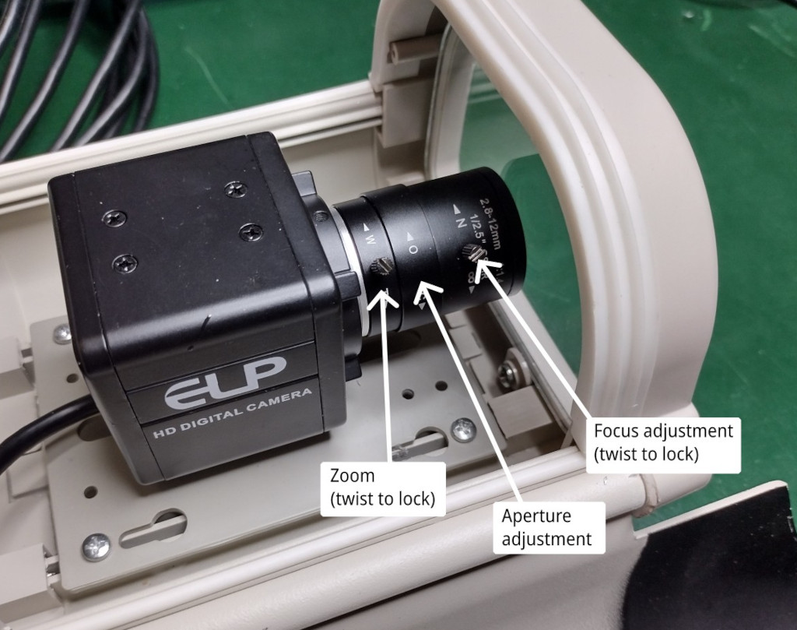
Adjust the **aperture ring** on the camera lens until the image is correctly exposed, allowing for likely changes in ambient light.  The focus should hopefully not need adjusting.  Close the weatherproof case and align the camera so it is looking straight across the finish line (positioning of the camera is more critical than the RFID aerials), with either a mark on the track or the RFID cable in view as a reference point.  **Close the monitor/focus window**.
1. Align the **IR beam break** with the ScotchLite reflector on the RFID aerial on the far side of the track.  The LED on the beam-break unit should light up when the beam is detected.  The drainpipe helps to keep sunlight out of the sensor, but range is limited to about 10 metres, so this will not always work at all tracks.
1. **Confirm that video is captured** when the **Auto-capture** button on the Trigger-O-Matic is pressed.  Now enable the Auto-Capture toggle switch on the Trigger-O-Matic and confirm that video is captured when the IR beam is broken.  Set the toggle switch back to 'Disable' for now, so as not to waste disk space capturing video of people warming-up.
1. Minimise CrossMgrVideo and leave it running in the background.

### CrossMgrImpinj

1. Start CrossMgrImpinj.
1. It should immediately establish a connection to the tag reader and the left pane will turn green.  Otherwise check the [BHPC troubleshooting guide][Communications Tagreader] for help diagnosing the communication problem.
1. Confirm that **Antenna Ports** `1` and `2` are enabled.  Icons should appear to indicate that the respective aerials are connected.
1. Confirm that **Monitor Power** is enabled for all power sources.  Icons should appear to indicate that the respective supplies are present.
1. Click **Advanced**.  **Report Method** should be set to "**Quad Regresssion**", with **Remove Outliers** enabled.  Set **Antenna Choice** to "**Max Signal dB**"
1. Set **Tag Population** to 16.
1. Leave **Transmit Power** and **Receiver Sensitivity** blank.
1. Set **Connection Timeout** to `3` seconds, **Keepalive** to `2` seconds, and **Repeat** to `3` seconds.
1. Enable **Recalculate clock offset...** and **Beep on Read**
1. Click OK, and OK to "*Reset reader now?*".
1. If riders are milling around, you should start to see tag reads in the left hand pane, confirming that the RFID system is operating.  Otherwise, grab a tag and bring it in and out of range.  Ensure that you see reads from both antennas, confirming that they're properly connected.
1. Minimise CrossMgrImpinj and leave it running in the background.

### Internet Connection (Optional)

* If you will be using live results, ensure that the laptop's WiFi is connected to something that provides internet connectivity.  Typically this will be a smartphone or portable hotspot, but you might be able to use eg. the Club-house WiFi at Hillingdon.

### CrossMgr

1. Open a **File Explorer** window and navigate to the race file directory you created for the day's racing.
1. Make any **last-minute changes to the sign-on sheet**.
1. Double-click the `.cmn` file for the first race.  CrossMgr should start and you should be looking at the [Actions][] screen.  *Do not* click on the big friendly '**Start Race**' button until you mean it!
1. Switch to [Properties][] and double-check the settings in each of the tabs.  Refer to the earlier part of this guide if necessary.
1. Also check the [Categories][] screen.
1. If you will be using live results, confirm that the FTP upload works.  **Check that an `index.html` page linking to the race file(s) is present on the web server**: You may need to perform a batch publish of the un-started race(s).
1. If this is all okay, go to the [RFID][RFID] tab on the [Properties][] screen, and click **Setup/Test RFID Reader...**
1. Start the **RFID test**.  CrossMgrImpinj should establish a connection and you should start to see tag reads in the **Messages** pane.
1. You can **leave the RFID test running** until the race is about to start.  This allows you to check that riders' tags are working.

### Race Clock

* With the **RFID test running**, now is a good time to check the **Race Clock**:  Look at the display on the back of the clock.  By now it should have connected to the `BHPC_Timing` WiFi network, and have established a WebSocket connection to CrossMgr, causing the respective LEDs to illuminate.
* Check the LED display is working properly.  If the heartbeat is enabled, you should see the last LED in the display (lefmost LED of middle segment of the leftmost digit) flashing red a couple of times a second.  This confirms that data is making its way to all pixels in the display.
* If there are problems, check the [BHPC troubleshooting guide][Clock Issues] for more details.
* Ensure that the clock is facing in a direction that allows racers to see it properly, that the stand is secure, that the power cable is not a trip hazard, and that people aren't standing in front of the display.

### Someone needs tags!

* This is usually the point in proceedings where someone will come to you with a sob story about having to remove their timing tags for a pedal car race, shipping their helmet to Battle Mountain or their fairing being eaten by a grue.  Alternately, you may have established that their existing tags are not working properly during the RFID test, or are in danger of peeling off.  Either way, they need new timing tags.

* First, **check that you haven't already got a set of new tags** for them in the tag bag - riders will not always remember if they asked for new tags at sign on, and neither will you.

If you do have to write new tags, see the section on [Writing RFID timing tags][Writing Tags] above.

### Moving a rider to a different race within a round

Sometimes you will need to move a rider to a different race, perhaps because they are late arriving at the event, or they are going to share a HPV with a rider in another race.

#### Using HPVMgr (preferred)

HPVMgr makes this straightforward:

1. **Open HPVMgr** and ensure the correct rider database is loaded.
1. Switch to the **Events** screen, and select the relevant **Season**, **Event** and **Round**
1. Switch to the **RaceAllocation** screen, and move the racer to the desired race using the right-click context menu options.
1. When you are happy with all the allocations, click "**Write sign-on sheet**" to write the `.xlsx` file to disk for CrossMgr.
1. Save the changes to the database before exiting HPVMgr.

#### Using the BHPC Organisers' spreadsheet

If the **BHPC organisers' spreadsheet** was used to generate the sign on sheet, race allocations can be changed easily.  Note that re-writing the sign-on sheet will lose any category/machine changes that have been made manually.  Don't forget to save the changes!

#### By manually editing the sign-on spreadsheet

Alternatively, the sign-on spreadsheet can be edited directly using Excel.  This is necessary in order to make race-specific category or machine changes.

* Note that when cut&pasting a rider's entry from one sheet to another, the rider's **EventCategory** field will need to be changed to match that of the new race.
* Be careful with the spelling of category names, if they are not consistent, CrossMgr will treat them as separate categories.
* If you overwrite the file using **HPVMgr** or the **BHPC organisers' spreadsheet**, manual changes will be lost.

### A rider has changed their Category/Machine/Timing tags

Sometimes a rider changes machine or category (eg. swapping machines or removing a fairing due to mechanical problems) immediately before or during a race...

*Don't panic!*

These changes can be made retrospectively after the race, so if the race is about to start, it's best to make an accurate paper note of which rider (get their bib number) and what they're riding, and worry about updating the sign-on sheet later.

#### Using HPVMgr:

**HPVMgr** makes it simple to manage these changes and re-write the sign-on sheet, so you shouldn't ever need to edit the sign-on sheet manually in Excel.  See the **HPVMgr help documentation** for more details.

##### If the change applies to the whole event...

1. Open **HPVMgr**.
1. Select the relevant Season and Event on the **Events** screen.
1. Switch to the **EventEntry** screen.
1. Right-click on the racer and select "Edit details" from the context menu.  The racer's entry will be highlighted in **Orange**
1. Make changes to the machine and category details at the top of the screen.
1. Click "**Enter/Update racer**" and then "OK" to update their entry.  The racer's entry will no longer be highlighted, and the entry will reflect the changes.
1. Re-write the sign-on sheet using the option from the **"Tools**" menu.
1. Save changes to the database and quit HPVMgr.

If you need to make global changes to a rider's tag numbers, do so on the **RiderDetail** screen, and re-write the sign-on sheet.

##### If the change only applies to a specific round/race...

1. Select the relevant Season, Event and Round on the **Events** screen.
1. Switch to the **RaceAllocation** screen.
1. Right-click on the racer in the allocation list and select either "**Change machine**" or "**Change categories**" from the context menu.
1. This change will only affect the selected round/race; other rounds in the Event will continue to use the machine and categories as they were entered on the **EventEntry** screen.
1. Re-write the sign-on sheet.
1. Save changes to the database and quit HPVMgr.

#### Using the BHPC Organisers' Spreadsheet:

##### If the change applies to the whole event...

1. Open the BHPC organiser spreadsheet in Excel, and use the macros to remove the rider from the race.
1. Re-add them with the correct details.
1. Re-allocate them to the correct races.
1. Write the CrossMgr sign-on sheet.
1. Save changes and quit Excel.

##### If the change only applies to a specific round/race...

You will have to edit the sign-on spreadsheet manually using Excel.

* Take care to ensure that category names are spelled consistently, otherwise CrossMgr will consider it a new category.
* Ensure that changes are propagated into the combined sheets when merging races (see [Merging races][] below).

**If you have edited the sign-on sheet, subsequent use of the BHPC organiser spreadsheet to re-write the sign-on sheet will lose your changes!**

## Timing a race

### Final checklist:
* **Timing tent** guy ropes etc secure?  Are the table legs locked and weighed down? (Eg. with the flightcase or cable reel)
* Are the **RFID aerials** pegged or weighed down?
* Does the organiser have the **bell** and **flags**?
* Do you know where the **first aid kit** is?
* If you are using a **generator**, does it have plenty of **fuel and oil**?  Do you know how to refuel and restart it? (Do not refuel a running generator!)
* If you're racing, **is your bike ready**, do you have your helmet and elbow pads on?
* Place any **spare live tags** in the **RF-blocking tag bag** to prevent spurious reads.
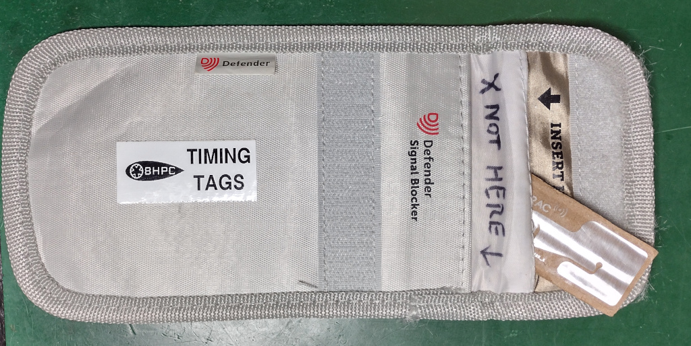
Ensure that you place the tags in the correct compartment of the bag - the front pocket does not block the signal.  Unwritten tags with their factory unique EPC numbers are harmless.
* Check the flight-case **power supply**:  Are AC and DC power present?  Is the AC power failure **alarm enabled**?
* Is the **laptop** running on AC power?  Is its battery charged?
* Are there any **notifications** from **Windows** (eg. wanting to reboot for updates, virus warnings) that might cause problems?
* Does the **GPS time source** have a satellite signal (orange LED lit or flashing)?  Does it have a time signal (blue LED lit or preferably flashing once per second)?
* Check **CrossMgrVideo**:  Is the camera aligned, with correct **focus and exposure**?  Look at the small preview image (bottom left) or focus window, *not* the still frame from the last trigger in the main window!
* Is the **IR beam break** aligned and operating the Trigger-O-Matic correctly?
* Check **CrossMgrImpinj**.  Is it connected and reading tags?  Are tags being read on both antennas?  Press the reset button and confirm the **clock offset** is still reasonable (typically 3600 seconds to within one second during *British Summer Time*).
* Is **CrossMgr** open with the **correct race** file?
* Is the **RFID test** successful?
* Is the **Race Clock** working and visible?  If it's likely to blow over, place it at ground level.
* Does someone have a **backup stopwatch** ready?
* Get a **headcount of riders**  on the start line.  Does it match your sign-on sheet?  Establish the **known DNSes**.
* Do you have a **pen and paper** ready to note down anything of importance during the race (eg. DNFs, incidents, HPV changes, etc.)  *Write the race name on it clearly, and start a new sheet for each race.*
* Do you have someone who can read race numbers out to you for manual entry if the RFID system fails?
* Do you have a device that can **video the finish** if the timing system fails?

### Starting the mass-start race

(At this point, CrossMgr is assumed to be open on the correct race file, likely with an RFID test in progress.  CrossMgrVideo and CrossMgrImpinj are running in the background.)

1. Finish the RFID test.  Switch to the [Actions][] screen and click the **Start Race** button.  The race will not start until you click '**OK**' on the dialog that pops up.
1. Tell the person starting the race that you're ready.  Pay attention so you don't miss the start.
1. Click '**OK**' when they say "Go!"
1. Switch to the [Results][] screen.  Riders whose tags were read immediately after the start will be listed.  Others will not.
1. Open the [Missing Riders][Windows] window.  This will show who hasn't yet been accounted for, so you don't have to work it out by hand.
1. If using the IR beam-break, enable the **Auto-Capture** toggle switch on the Trigger-O-Matic.
1. As the riders come round for their first lap, keep an eye out for anyone whose tags aren't reading.  Refer to the [BHPC troubleshooting guide][BHPC Troubleshooting] if necessary.
1. Check that CrossMgrVideo is being triggered by CrossMgr, and capturing video successfully.

Once all riders are accounted for, you can close the [Missing Riders][Windows] window.  In theory you shouldn't have to do anything other than keep abreast of DNFs and similar incidents.  Keep an eye out for missed reads and other problems, and check the camera exposure if the ambient light level changes drastically.

Refer to the [BHPC troubleshooting guide][BHPC Troubleshooting] if something goes wrong during the race, eg. tags not reading.

### Race finish

#### A) Criterium race

As CrossMgr cannot determine when the leader is going to get the bell, you will have to edit the race duration retrospectively once the bell lap time is known.

1. As the end of the race approaches, switch the [Results][] screen to show **Race Times**, so you can see when the leader is predicted to cross the finish line after the criterium duration has elapsed.  (Eg. For a 30 minute criterium, this would be their first race time greater than 30 minutes.)
1. Remind the *bell-ringer / flag-waver* to stand on the opposite side of the finish line, so they can be seen by the camera.  (It is much easier to work out if an image is of the final lap if the bell/flag is visible, and finish-line images of the organiser's leg are useless!)
1. Once the leader has been given the bell, *and CrossMgr has processed the associated tag read*, note the **race time** of their bell lap.  (Eg. For a 30-minute criterium, this might be `31:23`)
1. Switch to [Properties/General Info][General Info] and adjust the **Race Minutes** field to the next integer number of minutes.  (Eg. If the leader's bell lap was at `31:23` this would be `32` minutes.)
1. Click "**Commit**".
1. Return to the [Results][] screen.
1. Hopefully this shows the leader with a single predicted (yellow) lap still to go.  When they finish the race, this should turn white.  Other riders' predicted final laps will turn white as their tags are read.  If things look wrong, *don't panic* - changes to the race duration are reversible.  As long as you don't Finish the race, CrossMgr will keep recording tag reads, even if they are not currently shown in the Results.
1. As riders cross the finish for the final time, it's worth using the **manual buttons on the Trigger-O-Matic** to ensure that they are definitely captured on video.  (There is no harm in manually triggering the capture in addition to the automatic captures triggered by CrossMgr or the beam-break - CrossMgrVideo only stores a single copy of each video frame in the database.)  A short press of the **Auto-Capture** button will grab a few seconds of video, starting *before* you pressed the button.  Meanwhile, the **Capture** button will cause video to be recorded continuously for as long as it is held down, starting from when you press it.  Note that holding it down for more than 30 seconds or so at a time will put a very heavy load on the database - best to release it at intervals than to try to hold it down continuously for the entire finish.
1. BHPC races normally have lapped riders.  If all riders are predicted to ride the same number of laps as the leader, check the "**Lapped Riders Continue**" settings in the [Category Screen][].
1. When all riders have finished (or are confirmed to have DNFed), switch to the [Actions][] screen and click **Finish Race**.  *If there is any doubt that all riders have actually finished, leave the race running, as CrossMgr will stop recording tag reads when you finish the race.*

#### B) Fixed-duration race

Unlike a criterium, CrossMgr can work out when the end of the race is without intervention.

1. Remind the *bell-ringer / flag-waver* to stand on the opposite side of the finish line, so they can be seen by the camera.
1. You can sit and watch the predicted final lap times turn yellow as riders' tags are read.
1. As riders cross the finish for the final time, it's worth using the **manual buttons on the Trigger-O-Matic** to ensure that they are definitely captured on video.  (There is no harm in manually triggering the capture in addition to the automatic captures triggered by CrossMgr or the beam-break - CrossMgrVideo only stores a single copy of each video frame in the database.)  A short press of the **Auto-Capture** button will grab a few seconds of video, starting *before* you pressed the button.  Meanwhile, the **Capture** button will cause video to be recorded continuously for as long as it is held down, starting from when you press it.  Note that holding it down for more than 30 seconds or so at a time will put a very heavy load on the database - best to release it at intervals than to try to hold it down continuously for the entire finish.
1. When all riders have finished (or are confirmed to have DNFed), switch to the [Actions][] screen and click **Finish Race**.  *If there is any doubt that all riders have actually finished, leave the race running, as CrossMgr will stop recording tag reads when you finish the race.*

#### C) Fixed number of laps

CrossMgr can work out when the end of the race is without intervention.

1. Remind the *bell-ringer / flag-waver* to stand on the opposite side of the finish line, so they can be seen by the camera.
1. You can sit and watch the predicted final lap times turn yellow as riders' tags are read.
1. As riders cross the finish for the final time, it's worth using the **manual buttons on the Trigger-O-Matic** to ensure that they are definitely captured on video.  (There is no harm in manually triggering the capture in addition to the automatic captures triggered by CrossMgr or the beam-break - CrossMgrVideo only stores a single copy of each video frame in the database.)  A short press of the **Auto-Capture** button will grab a few seconds of video, starting *before* you pressed the button.  Meanwhile, the **Capture** button will cause video to be recorded continuously for as long as it is held down, starting from when you press it.  Note that holding it down for more than 30 seconds or so at a time will put a very heavy load on the database - best to release it at intervals than to try to hold it down continuously for the entire finish.
1. If all riders are not predicted to ride the full number of laps, check the "**Lapped Riders Continue**" settings in the [Category Screen][].
1. When all riders have finished (or are confirmed to have DNFed), switch to the [Actions][] screen and click **Finish Race**.  *If there is any doubt that all riders have actually finished, leave the race running, as CrossMgr will stop recording tag reads when you finish the race.*

#### D) *n*-lap Time Trial

The end of the race is simply when everyone has had their turn, the timing is not critical.

1. When all riders have finished (or are confirmed to have DNFed), switch to the [Actions][] screen and click **Finish Race**.  *If there is any doubt that all riders have actually finished, leave the race running, as CrossMgr will stop recording tag reads when you finish the race.*

#### E) Best of *n* laps

The end of the race is simply when everyone has had their turn, the timing is not critical.

1. When all riders have finished (or are confirmed to have DNFed), switch to the [Actions][] screen and click **Finish Race**.  *If there is any doubt that all riders have actually finished, leave the race running, as CrossMgr will stop recording tag reads when you finish the race.*

#### F) Flying Sprints

This is much like a time trial.  See the **SprintTimer** documentation for details of how to operate the SprintTimer software.

## After the race

1. Before making non-trivial corrections to the race data, **close CrossMgr and create a backup copy of the file**.
1. Set riders to **DNF** as needed.
1. Investigate riders who stopped, or whose tags weren't reading.  Make notes of when they stopped.
1. If you have time, correct for any stoppages and refer to CrossMgrVideo to see if you can fill in any missing lap times.
1. If a rider's results are a mess and you'll have to come back to it later, set their status to **NP**.
1. **Batch publish** the race to the web so the live results are up to date.
1. Ensure that your **paper notes** are in a safe place.
1. Move on to **setting up the next race**.  Unless you urgently need to know the ranking to award trophies, correcting results is best done somewhere warm, dry and quiet without any time pressure or interruptions.

## Packing up

At the end of the final race, close CrossMgr and ensure that **all race data is backed up**.  Close CrossMgrVideo and CrossMgrImpinj, and shut down the laptop, then you can disconnect the equipment.

* The camera, Trigger-O-Matic and IR beam break sensor live in the flight-case with the RFID reader, along with a 4-way mains adaptor.
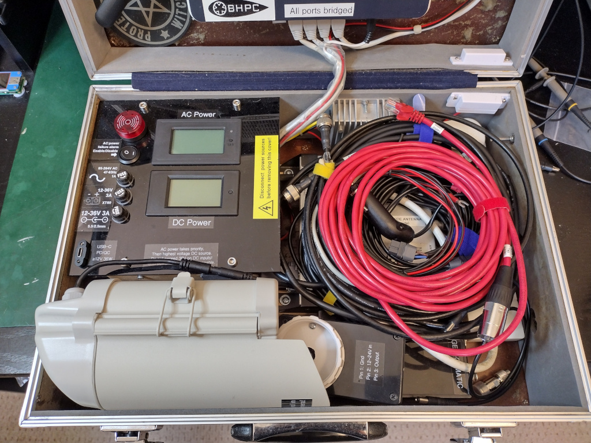
* Note the camera only fits properly in the labelled orientation (lying on its right side in front of the power supply, facing right), and **ensure that the WiFi aerial on the left of the router is folded downwards** so as not to be crushed by the camera when the lid is closed.
* Take care to avoid damaging the thin coaxial cable connecting the **patch antenna** to Antenna port 4 of the **Tag reader**.
* Coil the assorted cables into the remaining space on top of the tag reader, trying to make the pile as flat as possible so the lid can close.  **DO NOT force the lid closed, you may damage something important and/or expensive!**

Item|Location
:---|:------
Camera|Flight-case
Trigger-O-Matic|Flight-case
IR Beam break|Flight-case
4-way mains adaptor|Flight-case
Flight-case AC power cable|Flight-case
2.5mm to 2.1mm DC barrel jack cable|Flight-case
XT60 to spade connector cable|Flight-case
XT60 to car cigarette lighter cable|Flight-case
Short TNC to RP-TNC coaxial cable|**Must** go in flight-case for writing tags for next race
Red Ethernet cable|Flight-case
5m male XLR to female XLR cable|Flight-case
Male USB-A to male USB-B cable|Flight-case
Laptop|Laptop bag
Laptop power supply|Laptop bag
USB-C to Acer DC jack adaptor|Laptop bag
HDMI cable|Laptop bag
Misc USB cables|Laptop bag
Mouse|Laptop bag
Clipboard|Laptop bag
RF-blocking tag-bag|Laptop bag
Jiffy bag of unused tags|Laptop bag
Small pens|Laptop bag
Long male N-connector to RP-TNC plug coaxial cables|Timing crate
Race clock AC power cable|Timing crate
BS1363 to 16A Ceeform adaptor|Timing crate
Bell|Timing crate
Flags|Timing crate
Marker pens, scissors, etc.|Timing crate
Gaffer tape|Timing crate
Random cardboard, correx, etc|Timing crate
Foam pads for spacing tags off conductive materials|Timing crate
Steel tent pegs for aerials|Timing crate
Mallet|Timing crate
Aluminium tent pegs for timing tent|**Must** go in tent bag
Right-angle N-connector adaptors|Leave attached to back of trackside aerials so they don't get lost
Stopwatches|First-aid kit (So they travel separately from the rest of the timing equipment.)
Trackside antennas|Travel separately in reinforced Jiffy bags
Desktop antenna|**Must** go with flight-case and laptop bag for writing tags for next race

# Post-processing results

## Finish line photos

Perhaps unintuitively, this is usually the best place to start, as it will be useful for correcting finish times.

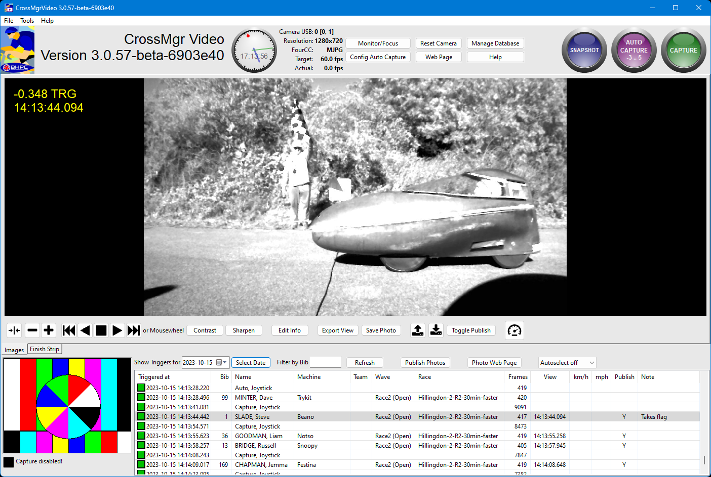

1. Start CrossMgrVideo.  Select **"Disable Capture**" from the Tools menu (this stops it wasting system resources maintaining a ring-buffer of the internal webcam feed).
1. If necessary, select the race date using the **Select Date** button.

Then, for each race:

1. Determine the **leader's finish time** from CrossMgr.
1. Locate the associated trigger in CrossMgrVideo, and confirm they take the flag.
1. Use the mouse scrollwheel (or **+** and **-** buttons in the GUI ) to **find the frame** where the HPV crosses the finish line.
1. Click the "**Save view to the Database**" icon to mark this frame.
1. Click **Edit Info** and put "Takes flag" in the Note field for future reference.
1. Click the "**Toggle Publish**" to enable publish for this image.
1. Right-click on the trigger in the list, and select "**Publish wave finishes from here**" from the context menu.  CrossMgrVideo will automatically select one trigger for each subsequent rider in the race for publication.  This saves you having to keep track of which riders you've processed so far.
1. For each selected-for-publication trigger, find the frame where the HPV crosses the finish line, and **Save the view to the database**.
1. If for some reason the trigger does not show the rider getting the flag (Eg. a missed read on their final lap, and you are looking at them warming-down), de-select it for publication, and go hunting for that rider's true finish time.  Note that DNF riders will, by definition, not finish but they may have caused a stray tag read that triggered a capture.
1. If you do not have an image of a rider's finish, it's okay for them not to have one.  If you're feeling completist, you can locate the trigger of a DNF rider's last completed lap and select that for publication in lieu of a finish photo.

Once you have selected the triggers for all races (possibly after you finish processing their CrossMgr and SeriesMgr data), you can generate HTML and image files for publication on the web:

1. Click the "**Photo Web Page**" button to open the Photo Publish dialog.
1. Browse to an empty directory to store the photos.  Eg. "`C:\Users\BHPC\Documents\BHPC Racing\2025\Photos\07 Darley Moor`" and click **Select Folder**.
1. Set **Photo Output** to "**Selected: Output a photo for each trigger selected for publication**".
1. Set **Web Page Generation** to "**Recommended: .html page lings to photos in separate .jpeg files**"
1. Click **OK**.  It may take a few seconds to generate the files.
1. Open the generated index page in a web browser and confirm that it works properly.
1. To transfer the files to the BHPC web-server, use an FTP client.  FileZilla on the laptop should be configured with the relevant login details.

## Fixing the timing data

Keeping CrossMgrVideo open in the background (or even better, on another display device) for reference, open the `.cmn` file for the race.
Fixing the race data is not an exact science, but:

* If you have Category/Machine or Tag changes to do, refer to the section [A rider has changed their Category/Machine/Timing tags][Category Changes] above.
* Ensure the **leader's finish time** is correct (hopefully corroborated by the video timestamp showing them passing the chequered flag).
* For a criterium, check the **race duration **is adjusted so that this is the leader's final lap time.
* If you have tandem riders, you may want to copy the times from one rider to the other, especially if they don't all have timing tags.
* If you have **DNF riders**, ensure their status is set to DNF at an appropriate time.
* Now check you have good **finish times for all the other riders**.  If there is no tag read, you may be able to find them on the video (either triggered by another rider, or auto-captured).
* If there is a **close finish** (CrossMgr will highlight this in blue), refer to the video, and edit the finish times to match the video timestamps (this is higher precision than the RFID).
* Now, examine the rest of the **lap times**.  Look for yellow extrapolated lap times, or unusually long or short laps (the [Chart][] view may be helpful).  Try to reconcile these with your notes.  (Eg. Perhaps a rider stopped for a mechanical and lost some laps.  Or perhaps they walked behind the timing tent and accumulated some spurious reads.  Or maybe their timing tags were just reading intermittently.)
* If you have spurious reads, it may be helpful to adjust the **Min Possible Lap Time** to be just lower than the true fastest lap.
* To correct a rider's times, open the **RiderDetail** window, and disable **Autocorrect Lap Data**.  This will remove their extrapolated lap times, leaving the tag reads/manual entries that are not filtered.
* To add a missing laps, click on the long lap in the coloured chart, and **add splits** as needed.
* To **remove spurious laps**, delete or correct the times in the list on the left.
* If a rider's tags were not reading, check the **Unmatched RFID Tags** window, in case a tag with an unexpected number was recorded (This might indicate a problem with the sign-on sheet, a mistake made when writing tags, or perhaps they had a random tag from some other event that you can use retrospectively.)
* If you have a `.gpx` file from a rider's GPS unit, you can import this to generate lap times.  See [DataMgmt][] for details.
* If CrossMgr failed for some reason during the race, you may be able to recover tag read data from CrossMgrImpinj's own log file.
* Spooling through the video to see if you can spot riders in other riders' triggers is often fruitful.  Once you have entered some lap times, you can use the extrapolated laps as a guide to where in the video to look.
* Eventually you should have corrected everything you can with the information you have.  If necessary, appeal to the BHPC forum for more information; riders are likely to know their position relative to each other, which you can use to fudge the times as necessary.

## Merging races

Where a **round** has been split into more than one **race**, it is necessary to combine the results in order to determine the overall ranking for that round.  We used to do this using an Excel macro called Merge-O-Matic, but this was a nightmare to maintain, as it had to handle all sorts of edge-cases in the results (eg. categories with no finisher), and would break with minor changes in the format of CrossMgr's Excel output.

Instead, this functionality [is now built into our version of CrossMgr][Merging].  This simplifies the workflow, as you do not have to generate several Excel files in order to combine results, and you can make late adjustments to lap times etc. in the combined file without having to re-do the merge.  It's also programmatically simpler, as the recorded lap time data is merged before CrossMgr performs its filtering, category and ranking calculations, which should hopefully make it more robust.

Our merging procedure effectively imports subsequent races in a round as additional **start waves** of the first race, with a very long gap between them.  CrossMgr's **CustomCategory** logic then combines the results of riders from multiple start waves who share that CustomCategory.  For this to work, we need a **unified sign-on sheet** for the round, with riders in each race having a different **EventCategory**.

1. Ensure you have backup copies of all the race data.  There's great potential for corruption if something goes wrong!
1. Open the **chronologically first** (usually slower group) race.  Change the [Event Name][General Info] to something appropriate for the combined results.  CrossMgr will warn that it is saving to a new filename.  This will create a copy of the existing race data.  Close CrossMgr.
1. If necessary combine the sign-on sheets for the individual races into a new sheet in the sign-on Excel file.  If HPVMgr was used to generate the sign-on sheets, this will have been created automatically).  This is simply a matter of copy&pasting:  For example, copy the `Round1Race1` sheet (inclding headers) to a new `Round1Combined` sheet, then copy&paste the data from the Round1Race2 sheet into it.  Note that if the sign-on sheet for a race has been edited manually (eg. to reflect a change of machine), these will need to be preserved in the sheet for the combined results.
1. Open the .cmn file for the combined results.  At this point, it will just be a copy of the first race.
1. Use [Link External Excel Sheet][External Excel] to select the combined sign-on sheet.  Ensure that "**Initialize CrossMgr Categories from Excel EventCategory and Bib# columns**" at the relevant stage.
1. The [Categories][Category Screen] may need rearranging, lap distances and genders set, etc.  Note that you now have a **Start Wave** for each race.
1. The [Results][] may show nonsense lap times for some of the fast race riders.  This is because their tags were read during the slow race, and is harmless.
1. Select [Import from another CrossMgr race...][Merging] from the [DataMgmt][] Menu.  Browse to the `.cmn` file of the fast race.
1. Set **Data Policy** to "**Merge New Data with Existing**"
1. Ensure that **Adjust Start Waves** is enabled.
1. Click '**OK**'
1. Warnings that a rider appears in both races are harmless.  These are the ones whose tags have been read during the other group's race.
1. You should now see the combined results.  Note that the offset for the new start wave has been calculated based on the difference between the two race start times.  Tag reads that occurred before a given rider's start time are filtered out, as are those after their finish, in the usual way.  CustomCategory results will normalise the riders' start offsets, so it is as if they were all competing in the same race.
1. If this is a criterium event, ensure that [riders are being ranked by Average Speed][Race Options]; this is what the BHPC considers to be the fairest way of ranking riders who participated in races of different durations.

To merge more than two races, merge the frist two, and then merge the third with this combined race, and so on.

## Finish times for DNF riders

The BHPC credits DNF riders for the laps they completed during the race, by calculating the average speed for a virtual finish time.  This should be done **after merging races**, for reasons that will become apparent.

1. Open the `.cmn` race file for the round (after merging, if necessary).
1. Select [Give unfinshed riders a finish time...][Give Unfinished] from the [Edit][] menu.
1. Select status **DNF** and "**Last finisher's time**"
1. Click '**OK**'

DNF riders should now have **Finisher** status, with a long last lap that effectively finishes at the same time as the last finisher.  They will be ranked in the results accordingly.

## Change the FTP path and publish

1. Open the `.cmn` race file for the first round.  (This may be after merging, or a standalone race.)
1. Go to [Properties/(S)FTP][FTP] and change the upload and URL path to the correct directory for the finalised results.  (Eg. `/www2.bhpc.org.uk/public_html/wp-content/uploads/Events/2025/07/`)
1. Batch publish the HTML results and index.html to upload them to the web.
1. Repeat this for the rest of the rounds.

## Scoring

Once you have the finalised race results, you can load them into **SeriesMgr** to allocate championship points.

1. Navigate to the season's SeriesMgr directory, and open the season's master .smn file.  (Eg. "`C:\Users\BHPC\Documents\BHPC Racing\2025\SeriesMgr\BHPC_2025.smn`") If this is the first race of the season, make a copy of the previous season's series to use as a template, then delete all the races from it and change the Series Name accordingly.
1. On the **Races** screen, click the **Add Races** button, and select the .cmn file for the round you are adding.  (If the round is a sprint, you will have to export the results as an Excel file from the SprintTimer application - SeriesMgr cannot read the `.spr` data files natively.)
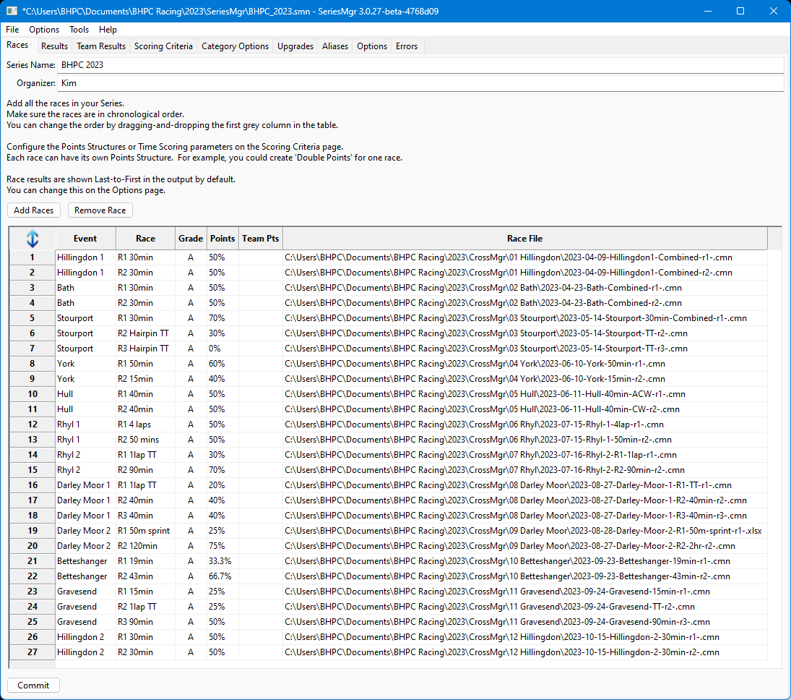
1. Set the **Event** and **Race** names in the table to something consistent with the standard formatting.  (Eg. "`Darley Moor1`" and "`R1 30min`" respectively.)
1. Leave **Grade** as "A", and select a **points structure** for the round as agreed by the race organiser.  (Points structures are a percentage of the total points for the event's racing.)  If a round is unofficial or just for fun, you can use the "0%" points structure so that riders are ranked in the championship table, but not allocated any points.
1. Click the **Commit** button.
1. Flip to the **Results** screen, and click **Refresh**.  Inspect the calculated points for obvious errors.
1. You might need to adjust the "**Consider...**" settings on the **Scoring Criteria** screen.
1. Check the **Category Options** screen.  Sort the categories into the standard order (Open; Partly-Faired; UnFaired; Faired Multitrack; Streed; Women; Women Part Faired; Arm-Powered; Junior; Car-Free by dragging the number on the left.  If there are 'Race' categories corresponding to start waves, de-select them for publication.  If there are spurious women's versions of categories, then [the category's gender needs adjusting in the race file][Spurious Womens].
1. Return to the **Results** and sort the riders by name.  Look for riders who have appeared under multiple names, or who have multiple names for the same machine, and use the **aliases** screen to combine them.
1. The results are now ready for publication.  Click **Publish to Html** and inspect the generated series page.
1. If you are happy, click **Publish to Html with (S)FTP**.  Check the FTP details, particularly that the **Path on Host** and **URL path** are correct.  Click '**OK**' to publish directly to the website.

### Points tables for individual events

The easiest way to generate these (while keeping categories, aliases etc. consistent) is by duplicating the current seasons's series and then removing the unwanted races.

1. Select **Save As** from the **File Menu**
1. Create a new folder for the event within `C:\Users\BHPC\Documents\BHPC Racing\2025\SeriesMgr\`
1. Save the series as points.smn within that directory.
1. Switch to the **Races** screen, and edit the Series Name accordingly.
1. Delete the races corresponding to other events.
1. Clear the **Event** field for the races - this prevents Event columns being generated in the HTML output.
1. Save the series, and publish as required.  Make sure to change the paths when publishing by FTP.

## Clean up for next time

* Using an FTP client, clean up the `/www2.bhpc.org.uk/public_html/wp-content/uploads/Events/liveresults` directory on the web server, so that interested parties do not mistake the live results for the final corrected version.
* Once any quibbles are resolved, upload a copy of the race data to [the BHPC's Google Drive storage](https://drive.google.com/drive/u/1/folders/1GJG1ahZJvge4mjT_PLBIx4B_dZPAFian) for backup.

# Glossary

To avoid confusion, we have tried to be consistent with the CrossMgr suite's use of terms like 'Bib' and 'Category' as much as possible.

Term|Meaning
:---|:------
Alias|In SeriesMgr, aliases are used to unify different spellings of a **rider**, **machine** or **team** name across a **series**.  For example, when a rider appears as "Joe Bloggs", "Joe Blogs" and "Joseph B" in the results of different races, *Name Aliases* can be used to consolidate their results.
Antenna|American for 'aerial', in the radio sense.  (In the interests of consistency with the CrossMgr documentation, we've tried to use this term throughout.)  The RFID system uses a pair of **track-side antennas** on stands either side of the finish line to communicate with riders' **RFID tags**.  A smaller 'desktop' antenna is also available: This is useful for writing tags, and for its reduced range when it is important to avoid reading tags from riders on the far side of the track.  A small **PCB patch antenna** is built into the flightcase in front of the **tag reader**, covered with foam to keep tags at a suitable distance.  This is useful for writing tags.
Bell|In cycle racing, a bell is rung to indicate that a **rider** has one **lap** remaining.
Bell Lap|The race leader's last **lap**.
BHPC|The [British Human Power Club](https://www.bhpc.org.uk/)
BHPC Organisers' Spreadsheet|An Excel file containing an unwieldy collection of VBA macros that automates the entire process of running BHPC races.  Unfortunately, this is slow and buggy (with a penchant for uninformative error messages), and does not fully support all the relevant CrossMgr features.  We have been progressively moving as much of our workflow away from this system to the CrossMgr suite since 2019.
Bib number|A rider's race number, as printed on the side of their HPV, and used identify them in HPVMgr/CrossMgr/SprintTimer
Carbon fibre|Lightweight composite material notable for its radio-blocking properties.  Do not attach RFID tags directly to carbon fibre.
Category|A class of rider (eg. Junior) or HPV (eg. Part-Faired).  In CrossMgr terms a [Category][Category Screen] is a list of bib numbers and associated meta-data that defines how they are timed and scored.
Class|Historical **BHPC** term equivalent to **category** that, in the interests of clarity, we've tried to avoid using in this documentation.
Coaxial|A type of electrical cable or connector in which one conductor completely surrounds another.  Used for radio-frequency signals, because physics.  The connections between the **RFID tag reader** and its aerials are coaxial.
Component Category|A sub-category that makes up a **Start Wave**.  We don't usually use these in **BHPC** racing, as unlike **CustomCategory** they cannot overlap.
Criterium|A type of cycle race where riders race for a certain period of time, and then complete an extra lap.  **CrossMgr** cannot handle this on its own, as it cannot know whether the leader will cross the finish line before or after the time period has elapsed until after it has happened.
CrossMgr|A software application designed for timing cyclocross races developed by Edward Sitarski.  The suite of applications that complement CrossMgr.
CrossMgrImpinj|A software application that allows **Impinj** **RFID** readers to be used with **CrossMgr** by emulating a **JChip** reader.
CrossMgrVideo|A software application that grabs short sequences of video from a **USB** camera and stores them in a database.  Used in combination with **CrossMgr** to collect time-stamped **finish line** images.  
CustomCategory|**CrossMgr** term for an arbitrary [Category][Category Screen] that is used to generate a ranking, but does not control when riders start and finish.
DNF|*Did Not Finish* - status given to **riders** who fail to complete a **race**.
DNS (computing)|*Domain Name System* a system for resolving human-readable names like `www.bhpc.org.uk` to IP addresses like `92.53.241.24` and vice-versa, by querying a *DNS Server*.  A DNS server is not normally available at the track-side, so devices must be referred to by their IP address.
DNS (racing)|*Did Not Start* - status given to **riders** who fail to make it to the start line of a **race**.
DQ|*Disqualified* - status given to **riders** who will not be **ranked** due to some violation of `TEH RULEZ`.
Ethernet|The IEEE 802.3 standard for data communications (usually on twisted-pair cable, terminated with RJ45 modular connectors).  Ethernet is is typically used to carry TCP/IP.
Ethernet Switch|A device that forwards Ethernet packets from one wired network segment to another.  The **router** built into the flight-case with the **BHPC**'s tag reader includes a 4-port Ethernet switch.
Event|In this context, a day of racing.  Particularly for **points** purposes.
Excel|A functional programming language masquerading as a piece of accountancy software that's commonly used for managing databases.  **CrossMgr** reads its **sign-on sheet** in Excel format, and can also output results in Excel format.
Fast Race|A **BHPC** **race** composed of mainly faster, or more experienced, riders.
Filtering|When **CrossMgr** ignores tag reads due to some internal logic  (eg. multiple tag reads occurring too close together to be distinct laps)
Finisher|Status given to **riders** who complete (or are expected to complete) a **race**.
Finish line|The place on the track where you set up your RFID aerials and finish line camera.  In **BHPC** events this is usually the same as the start line.
Finish order|The order in which **riders** cross the **finish line** at the end of a **race**.  This is the most important piece of race data, and if riders are close together cannot always be determined by **RFID** alone: Human observation or video evidence may be required.
Flag|A chequered flag is waved to indicate that riders are finishing the **race**.  We may refer to a rider 'getting the flag' when their race is over.  A red flag is used to stop the race in an emergency.
FTP(S), SFTP|*File Transfer Protocol (Secure)*, *SSH File Transfer Protocol* - Protocols used for transferring files over a TCP/IP network.  CrossMgr uses this to upload results to a website.
Gender|In **CrossMgr** terms this may be one of 'Open', 'Women' or 'Men'.  Most **BHPC** [Categories][Category Screen] are 'Open'.
Global Shutter|A type of electronic camera where the state of every pixel in the image sensor is recorded at the same moment in time, rather than reading them sequentially.  This prevents *rolling shutter distortion* artefacts on moving objects.
GPS|*Global Positoning System*.  A satellite navigation system that can be used to determine positions in space and time.
GPX (track)|A standard file format used by **GPS** receivers to record positions over a period of time.  Used by **CrossMgr** to draw the race animation, and to import lap times for riders.
Hexadecimal, Hex|Numbers in base 16 (0-F), rather than the usual base 10 (0-9).  Used for tag numbers.
HID|*Human Interface Device*.  A standard for **USB** keyboards, mice, joysticks, etc.  CrossMgrVideo can be triggered by a HID Joystick.
HPV|*Human Powered Vehicle*, for example a bicycle, tricycle, handcycle, wheelchair, velomobile, streamliner or pedal car.
HPVMgr|A software application for managing the BHPC riders database, creating **sign-on sheets** for **CrossMgr**, and writing **RFID tags**.  Written in 2024 by Kim Wall of the BHPC.
Impinj|The manufacturer of the *Speedway* **RFID** reader we use for timing races, and by extension their tag/hardware/software/protocol ecosystem.
IP address|A numerical address used to uniquely identify a device on a **TCP/IP** network.
JChip|An electronic timing system designed for sports events.  CrossMgrImpinj converts **LLRP** data from the **Impinj** reader into JChip protocol data for **CrossMgr**.
Lap|One complete circuit of a race track.
Lapped|A **rider** who has become far enough ahead in a **race** that they overtake a rider who is logically still behind them is said to have *lapped* the slower rider.  Lapped riders are expected in **BHPC** **races**, due to the wide range of **machines** and athletic ability.
Lap Time|The **race time** at which a rider crosses the finish line at the end of a lap.  May be extrapolated in the event of a **missed read**.
Leader|The **rider** currently in first position of their **race** or **category**.
License|In **CrossMgr**, a (?unique) identifier of **rider** used in **UCI**-compliant bicycle racing.  The **BHPC** don't use this.
LLRP|*Low Level Reader Protocol*.  The protocol used to communicate with the **Impinj RFID** reader over the **TCP/IP** network.
Local Time|The **time of day** in the appropriate time zone (eg. *British Summer Time*).
Machine|Attribute of a **rider** used to record the name of their HPV.
Mass Start|A **race** where multiple riders start at the same time.  Contrast with **Time Trial**.
Mechanical|When a **rider** stops during a **race** due to a problem with their **HPV**.  They may resolve the problem and continue, or opt to **DNF**.
Merge|A BHPC process for combining the results of multiple **races** to determine the results of a single **round**.
Merge-O-Matic|Deprecated **Excel** macro used for combining BHPC race results in Excel format.  This functionality is now built into **CrossMgr**.
Missed Read|When a rider crosses the **finish line**, but the **RFID** system doesn't detect their **tag**.
MultiReader|**Impinj** application that is useful for testing and for changing the tag number of RFID tags.
N-connector|A chunky threaded coaxial connector used on the **trackside RFID aerials**.  Sometimes found on laboratory test equipment, and in specialist RF applications.
NP|*Not Placed* - Non-judgemental status given to **riders** who should not be **ranked** for some reason (eg. because you know that their lap times are incorrect).
(S)NTP|*(Simple) Network Time Protocol*.  A protocol used by computing devices to synchronise their **real time clocks** over a **TCP/IP** network.
Points|Points are calculated by SeriesMgr.  Points mean prizes.
Points Structure|In SeriesMgr, a Points Structure is a mapping of rankings to numbers of **points**.  You can have a different points structure for each round.
Port (networking)|In **TCP/IP**, a numerical identifier that a particular piece of software listens for connections on.  For example, web servers usually listen on ports `80` and `443`, **FTP** servers on port `21` and **CrossMgr** runs a web server on port `8765`.  Different services on the same machine may listen on different ports at the same time.
PowerCon|A rugged electrical connector often used for providing AC power to professional audio equipment.  Notable for being weatherproof and having a twist-lock latching action.
Publish|In **CrossMgr** terms, the act of producing (and optionally uploading) race results in an easily-read format.
PUL|*Pulled* - status given to **riders** who have been removed from a **race** by officials, typically for being too slow.
Race|An instance of people rushing about on bicycles.  A **CrossMgr** `.cmn` data file pertaining to a **race**.  Contrast: **round**, **event**.
RaceDB|A software application for managing race entries and results written by Edward Sitarski.  The BHPC were unable to use this, as its handling of categories is too inflexible.
Race Clock|In this context, a device built by Kim Wall in 2021 to display the Race Time on a large LED display at BHPC events.  The Race Clock is also available as a web page on the **CrossMgr** local webserver.
Race Time|Time elapsed since the start of a race.  Compare with **Time of Day**
Ranking|A list of riders in order of winningness.  Not the same as *finish order*, as riders are likely to be on different laps.
Real Time|In computing, the processing of data quickly enough to keep up with it as it happens.  Perhaps unintuitively, **CrossMgr** does not process timing data in real time.  As such, the timing computer becoming slow to process data due to being overloaded does not normally affect the accuracy of recorded lap times, even if the user interface becomes sluggish.
Real Time Clock (RTC)|A subsystem of a computing device that keeps track of the **time of day**.  Often physically distinct from other time sources that coordinate the internal operation of the computer.  Electronic race timing relies on synchronising (or at least, accounting for the discrepancy between) multiple real time clocks.
Results|The outcome of a **race** or **round**.  Will include ranking and time data, but not **points**.  Those are allocated later.
RFID|*Radio Frequency Identification*.  In this context a long-range high-throughput tag system suitable for tracking vehicles, warehouse inventory and sports timing, rather than the short-range systems used for card-entry type applications.
Rider|A participant in a **race**.
RJ45|The cheap plastic modular connectors used on twisted-pair **Ethernet** cables.  Notable for requiring special tools to fit, and having an easily-broken retaining tab.  RJ45 connectors do not react well to being dropped in mud.  Some of our equipment uses RJ45 connectors in an **XLR** shell, for increased ruggedness.
Round|A particular type of **race**.  For example "30 minute criterium" "1-lap time trial".  At BHPC **events**, a **round** may be composed of more than one **race**, as the BHPC often splits the group for safety reasons.
Router|A device that forwards **TCP/IP** packets from one network to another.  The router built into the flight-case with the BHPC's tag reader is not actually used as a router; it is configured to work as a simple **Ethernet switch** and **WiFi** **access point**.  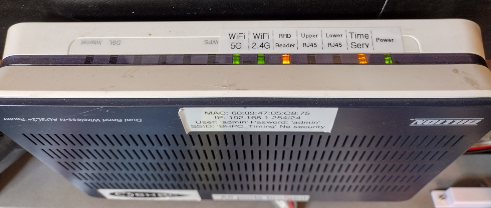
RP-TNC|*Reverse-Polarity Threaded Neill–Concelman*.  Confusing variation of the **TNC** coaxial connector with gender of the central pins swapped.  Used on the **RFID tag reader**. 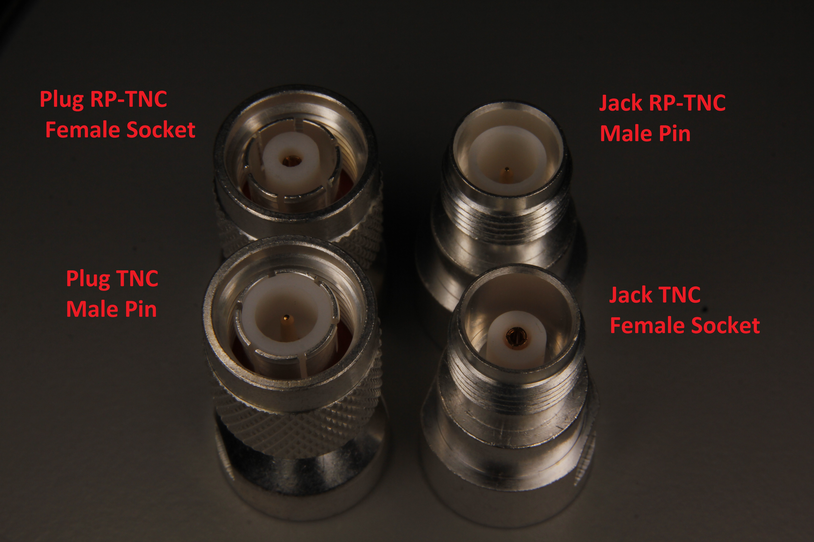
Series|A championship table for a racing season or **event**.  A SeriesMgr `.smn` file pertaining to a series.
SeriesMgr|A software application designed for allocating scores to a **series** of **race** results.  Part of the **CrossMgr** suite.  
Sign-on sheet|An **Excel** file containing details of riders, used by **CrossMgr** to populate the [categories][Category Screen] table and look up rider's names, teams, etc.  Crucially, this is needed in order to match **tags** to **riders**.
Slow Race|A BHPC **race** composed of mainly slower or less experienced riders.
Sprint|A **time trial** run over a very short distance, usually with a flying start.  Due to the high speeds involved, precision timing equipment is needed to judge sprint events; the **Impinj** **RFID** system is not precise enough.
Sprint Time|The duration (ie. **race time**) of a **sprint**.
SprintTimer|A software application designed for timing flying sprints, written in 2023 by Kim Wall of the BHPC.  It borrows heavily from **CrossMgr**'s codebase.
Sprint Timer Unit|A precision timing device designed for timing flying sprints, built in 2023 by Kim Wall of the BHPC.
Start Time|The **time of day** that a **mass start** **race** started at, or the **time of day** that individual **rider** started at in a **time trial** or **sprint**.
Start Wave|A **CrossMgr** term for a [Category][Category Screen] that defines a group of **riders** who start the **race** at the same time.  We would normally have a single Start Wave in a **race**.
Stopwatch|A standalone timing device that you can use to time **races** when you don't trust the timing system.
Stray tag|An **RFID tag** which has been within range of the **RFID** aerials for some time.  Usually an unused tag in the box of timing equipment, or a tag attached to a rider's helmet or HPV that has been left near the **finish line**.  Stray tags matching the **tag number** of a **rider** in the current **race** can cause all sorts of problems.
Tag|A physical RFID tag (as stuck to a rider's HPV or helmet), or the Product ID number encoded onto it. 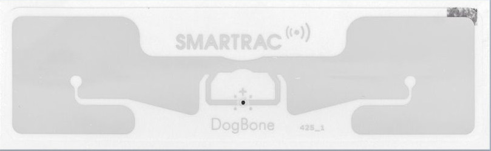  Tag numbers are sent to **CrossMgr** whenever a tag passes within range of the **RFID** aerials.
Tag reader|The **Impinj** *Speedway* unit mounted in the flight-case, which contains an embedded computer and the radio transmitter and receiver needed for reading and writing RFID tags.  This communicates with software running on the laptop using **LLRP** over **TCP/IP** over wired **Ethernet**. 
Tape Switch|An momentary electrical switch in a long, flat format that may be operated by pressure at any point along its length.  These can be used to trigger a timing device when a wheel passes over them.
TCP/IP|*Transmission Control Protocol/Internet Protocol*.  The de-facto standard protocol for computer networking.  Used by the **CrossMgr** suite applications to communicate with each other and with external hardware over **Ethernet** or **WiFi**.
Team|In CrossMgr, a Team is an attribute of a **rider**.  **Points** may be calculated on a team basis.
Time of day, Wall time|The time of day, possibly including the date.  May be UTC or in the local timezone.  Contrast with **Race time**.
Time Trial|A type of **race** where **riders** start at different times, and compete against the clock.
TNC|*Threaded Neill–Concelman*.  A small threaded coaxial connector used on the **desktop RFID aerial**.  Fiddly relative of the *Bayonet Neill–Concelman* connector usually found on laboratory test equipment and some professional video equipment.  Contrast with **RP-TNC** 
Trigger|Something that causes CrossMgrVideo to record a snippet of video in its database.  Triggers may come from **CrossMgr** over **TCP/IP**, manually from the mouse or keyboard, or via a **USB** device.
Trigger-O-Matic|A hardware device that generates **HID** joystick button events that trigger CrossMgrVideo.  This provides a nice big physical button that can be pressed quickly regardless of what the computer is displaying at the time, and an interface for a tape-switch or optical beam-break device.  
UCI|*Union Cycliste Internationale*.  Boring governing body who delight in banning things, and have a strange obsession with socks.
USB|*Universal Serial Bus*.  A standard system for connecting computing equipment that is frequently used to provide power to small electronic devices.  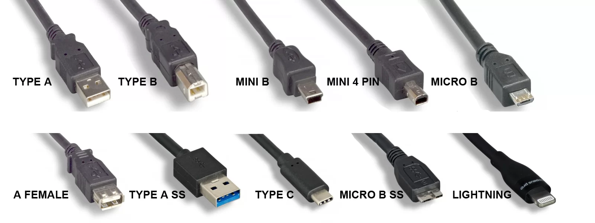
USB-A|The large, flat USB connector typically used on desktop computers and 'wall-wart' power supplies.
USB-B|The large square USB connector usually found on printers and scanners.  The Trigger-O-Matic, Race Clock and Sprint Timer Unit have USB-B connectors in the interests of durability.
USB-C, Micro USB-B, Mini USB-B|Various (incompatible) smaller USB connectors, usually found on small battery-powered computing devices like mobile phones and **GPS** receivers.  Some laptops use USB-C as a power connector, but notably not the *Acer Aspire 5* that the **BHPC** uses for race timing at the time of writing; its USB-C port is for data only.  (An adaptor to allow it to be powered from a USB-C power source is in the laptop bag.)
UTC|*Universal Time Coordinated*.  A pedant would point out that it's not technically the same thing as *Greenwich Mean Time*, but effectively that.  Software that has any sense tends to work with UTC internally, and only convert to local time for input and output.  **LLRP** always uses UTC time; **CrossMgrImpinj** calculates the offset to local time.
Webserver|**CrossMgr** and **SprintTimer** run a local web server on **port** `8765`.  This can be used to view live results or a browser-based verison of the **race clock**.
WiFi|In this context, the IEEE 802.11 standard for Ethernet-like data communications over spread-spectrum radio.  The **Race Clock** connects to the timing system using WiFi.
WiFi Access Point|The base station of a **WiFi** network.  Usually bridges to a wired **Ethernet** network.  Consumer-grade **routers** often have an access point built-in.
XLR|A latching electrical connector commonly used for communication signals on professional audio, video and lighting equipment.  It is robust and easily repaired in the field.  We use XLR connectors for the **Sprint Timer** and **Trigger-O-Matic**

